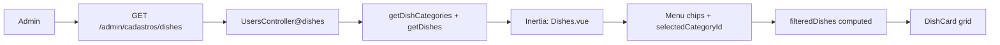

# Feature: admin-cadastros-pratos-menu

> Contexto: Listagem visual de pratos por menu/categoria no painel admin, dentro do módulo Cadastros (item **Pratos** no submenu). Layout baseado na referência de cardápio (chips de menu + grid de cards).  
> Depende de: `features/cadastros.md`, `features/auth.md`, `docs/database/schema.md`  
> Roles com acesso: `admin` apenas  
> Stack: Inertia.js + Vue 3, Laravel controller  
> URL: `http://127.0.0.1:8000/admin/cadastros/dishes`

---

## Objetivo

Exibir o **cardápio administrativo** em formato visual (não tabela): faixa horizontal de **menus** (categorias) e **grid de cards** com os pratos cadastrados. O admin filtra por menu e visualiza foto, nome, preço e classificação de cada prato.

**Fase 1 (esta spec):**

- Título dinâmico: `Menu (N itens)`
- Chip fixo **Todos** + chips por `dish_categories` (ex.: Burger, Bebidas)
- Grid de cards filtrado pelo menu selecionado (client-side)
- Botão **Criar menu** visível, **sem ação** (fase 2)
- Botão **Criar prato** ao lado, **desabilitado** / sem interatividade (fase 3)
- Dados reais via Inertia (`categories`, `dishes`)

Não há CRUD de menus nem de pratos nesta fase.

### Terminologia

| Termo na UI | Entidade no banco | Exemplo |
|-------------|-------------------|---------|
| **Menu** | `dish_categories` | Burger, Bebidas, Sobremesas |
| **Prato** | `dishes` | Chicken Deluxe Burger |
| **Classificação** (tag no card) | `dish_categories.name` via FK | pill `Burger` |

> O item do submenu de Cadastros continua **Pratos**; o título da área principal segue a referência visual: **Menu (N itens)**.

### Regra técnica de CSS (obrigatória)

- CSS não deve ficar embutido dentro de `.vue`.
- Cada componente/página deve usar arquivo externo em `styles`, por exemplo: `<style scoped src="./styles/Dishes.css"></style>`.
- Manter o mesmo padrão das telas de Usuários e Departamentos para legibilidade e manutenção.

### Referência visual

O layout base (chips horizontais com ícone + nome + contagem, grid de cards com foto, tag de categoria e preço, destaque laranja no menu ativo) segue a **referência de UI** fornecida no projeto (cardápio tipo “Menu (40 Items)”). Na fase 1, ícones por categoria podem ser placeholders mapeados por `slug`; não é obrigatório replicar ícones específicos (pizza, burger, etc.) pixel a pixel.

---

## Layout

### Estrutura geral

```
┌──────────────────────────────────────────────────────────────────────────────┐
│ [sidebar principal] │ topbar: Menu (N itens)     [Criar menu] [Criar prato] │
│ 52px                ├────────────────────────────────────────────────────────│
│                     │ [Todos] [Burger · 6 itens] [Bebidas · 3 itens] …      │
│                     │     ↑ scroll horizontal se muitos menus                │
│                     ├────────────────────────────────────────────────────────│
│                     │ ┌─────────┐ ┌─────────┐ ┌─────────┐ ┌─────────┐      │
│                     │ │  foto   │ │  foto   │ │  foto   │ │  foto   │      │
│                     │ │  nome   │ │  nome   │ │  nome   │ │  nome   │      │
│                     │ │ [Burger]│ │ [Pizza] │ │ [Burger]│ │ [Bebida]│ R$…  │
│                     │ └─────────┘ └─────────┘ └─────────┘ └─────────┘      │
└──────────────────────────────────────────────────────────────────────────────┘
```

### Cabeçalho da página (topbar)

| Posição | Elemento | Comportamento |
|---------|----------|---------------|
| Esquerda | `Menu ({{ itemCount }} itens)` | `itemCount` = quantidade de pratos **após o filtro atual** |
| Direita | `Criar menu` | Botão secundário/outline; **sem handler** nesta fase (`title="Em breve"`) |
| Direita | `Criar prato` | Botão primário; `disabled`, `aria-disabled="true"`, `pointer-events: none`, opacidade reduzida |

Layout textual esperado:

`Menu (12 itens)                              Criar menu    Criar prato`

**Contagem do título:**

- Com chip **Todos** selecionado: total de pratos listados (todos os registros retornados pelo backend).
- Com menu específico selecionado: apenas pratos daquela `category_id`.

### Faixa de menus (category chips)

Linha horizontal com scroll quando necessário (`overflow-x: auto`, sem quebra de linha).

#### Chip **Todos** (fixo)

- Sempre o **primeiro** chip.
- Label: `Todos`
- Subtítulo opcional: total geral, ex. `12 itens` (mesma contagem do título quando selecionado).
- `selectedCategoryId = null` → exibe todos os pratos.
- Ícone: grade/lista genérica.

#### Chips de categoria (`dish_categories`)

| Elemento | Fonte / regra |
|----------|----------------|
| Ícone | Mapeamento estático por `slug` em `dishCategoryIcons.js` (fase 1); coluna `icon` no banco é melhoria futura |
| Nome | `dish_categories.name` |
| Contagem | `N itens` — pratos **ativos** (`active = true`) na categoria; ver nota abaixo sobre listagem admin |
| Estado ativo | Borda `1px solid #E67E22`, texto/ícone `#E67E22`, fundo branco |
| Estado inativo | Borda `#eceef0`, texto `#17181e`, ícone `#5E6B7A` |

Interação:

- Clique no chip altera `selectedCategoryId` **client-side** (sem reload).
- Grid e `itemCount` no título atualizam imediatamente.

Ordenação sugerida dos chips (após **Todos**): `dish_categories.name` ASC.

### Grid de cards de prato

| Propriedade CSS | Valor |
|-----------------|-------|
| Layout | `display: grid` |
| Colunas | `repeat(auto-fill, minmax(220px, 1fr))` |
| Gap | `16px` |
| Desktop largo (~≥1200px) | ~4 colunas |

#### Estrutura de cada card (`DishCard`)

```
┌─────────────────────────┐
│                         │
│      [área foto]        │  ← aspect-ratio ~4/3, border-radius 12px
│                         │
├─────────────────────────┤
│ Nome do prato           │  ← max 2 linhas, ellipsis
│ [Classificação]    R$ … │  ← tag pill à esquerda; preço à direita
└─────────────────────────┘
```

| Área | Conteúdo | Detalhe |
|------|----------|---------|
| Imagem | `photo_url` | Derivado de `dishes.photo_path` via `Storage::url()`; se `null`, placeholder `#f0f1f3` + ícone genérico de prato |
| Nome | `dishes.name` | `font-weight: 600`, `font-size: 15px` |
| Classificação | `category_name` | Pill: fundo `#FFF4ED`, texto `#C05621`, `border-radius: 999px`, padding horizontal `8px` |
| Preço | `dishes.price` | Canto inferior direito da área de texto, bold; ver formatação BRL abaixo |
| Inativo (opcional) | `active === false` | Badge discreto `Inativo` no card (opacidade ~0.75 no card inteiro) |

Ordenação dos cards no filtro: `name` ASC (case-insensitive).

---

## Formatação de preço (BRL)

Utilitário `formatPriceBRL` em `resources/js/utils/formatPrice.js`:

```js
export function formatPriceBRL(value) {
    const amount = Number(value);
    if (Number.isNaN(amount)) {
        return 'R$ 0,00';
    }

    return new Intl.NumberFormat('pt-BR', {
        style: 'currency',
        currency: 'BRL',
    }).format(amount);
}
```

Exemplos:

| `dishes.price` | Exibição |
|----------------|----------|
| `12.50` | `R$ 12,50` |
| `1500.00` | `R$ 1.500,00` |

---

## Ícones de menu (`dishCategoryIcons.js`)

Fase 1: mapeamento estático por `slug` (sem coluna no banco).

```js
const CATEGORY_ICONS = {
    main_course: 'utensils',
    drinks: 'cup',
    desserts: 'cake',
    burger: 'burger',
    pizza: 'pizza',
};

export function resolveCategoryIcon(slug) {
    return CATEGORY_ICONS[slug] ?? 'grid';
}
```

Slugs desconhecidos recebem ícone genérico `grid`. Quando existir CRUD de menu (fase 2), pode-se adicionar coluna `icon` em `dish_categories`.

---

## Filtro client-side

Espelhar padrão de `filteredUsers` / `filteredDepartments`:

```js
import { computed, ref } from 'vue';

const props = defineProps({
    categories: { type: Array, default: () => [] },
    dishes: { type: Array, default: () => [] },
});

const selectedCategoryId = ref(null); // null = Todos

const filteredDishes = computed(() => {
    if (selectedCategoryId.value === null) {
        return [...props.dishes].sort((a, b) =>
            String(a.name ?? '').localeCompare(String(b.name ?? ''), 'pt-BR')
        );
    }

    return props.dishes
        .filter((dish) => dish.category_id === selectedCategoryId.value)
        .sort((a, b) =>
            String(a.name ?? '').localeCompare(String(b.name ?? ''), 'pt-BR')
        );
});

const itemCount = computed(() => filteredDishes.value.length);
```

Contagem nos chips de categoria (`dishes_count`):

- Backend pode enviar contagem só de pratos **ativos** para o subtítulo do chip.
- A listagem admin na fase 1 inclui **todos** os pratos (`active` true e false) para gestão; chips podem mostrar contagem só de ativos para alinhar ao tablet.

---

## Botões do cabeçalho

### Criar menu (fase 2)

- Visível na UI.
- **Sem** `@click`, **sem** rota POST nesta fase.
- Atributos sugeridos: `type="button"`, `title="Criar menu (em breve)"`.
- Estilo: secundário (outline), borda `#eceef0`, texto `#17181e`.

### Criar prato (fase 3)

- Ao lado de **Criar menu**.
- `disabled`, `aria-disabled="true"`.
- Estilo primário: fundo `#993C1D` ou `#E67E22` (laranja da referência), texto branco, opacidade `0.5`.
- `title="Criar prato (em breve)"`.

---

## Regras de negócio

- Apenas `admin` acessa (`firebase.auth`, `role:admin`).
- Menus (`dish_categories`) são configuráveis pelo admin na fase 2; seed inicial via `DishCategorySeeder` (Pratos Principais, Bebidas, Sobremesas).
- Pratos pertencem a exatamente uma categoria (`dishes.category_id` → `dish_categories.id`).
- FK `restrictOnDelete`: menu com pratos vinculados não pode ser excluído sem regra de negócio (documentar na fase 2).
- Listagem admin (fase 1): retornar pratos **ativos e inativos**; cards inativos com indicação visual sutil.
- Tablet/cliente (fora desta tela): usa apenas `active = true` (ver `schema.md`).
- Sem busca textual nesta fase (melhoria futura opcional).

---

## Fluxo de dados



---

## Rotas

| Método | URI | Controller@method | Middleware |
|--------|-----|-------------------|------------|
| GET | `/admin/cadastros/dishes` | `Admin\UsersController@dishes` | `firebase.auth`, `role:admin` |

```php
// routes/web.php (trecho existente)
Route::get('/dishes', [UsersController::class, 'dishes'])->name('dishes.index');
```

Nenhuma rota POST/PUT/DELETE nesta fase.

---

## Implementação — backend

Substituir o render vazio atual por props com categorias e pratos.

```php
<?php
// app/Http/Controllers/Admin/UsersController.php

public function dishes(): Response
{
    return Inertia::render('Admin/Cadastros/Dishes', [
        'categories' => $this->getDishCategories(),
        'dishes' => $this->getDishes(),
    ]);
}

private function getDishCategories(): array
{
    return DB::table('dish_categories')
        ->orderBy('name')
        ->get(['id', 'name', 'slug'])
        ->map(function (object $category): array {
            $activeCount = DB::table('dishes')
                ->where('category_id', $category->id)
                ->where('active', true)
                ->count();

            return [
                'id' => (string) $category->id,
                'name' => (string) $category->name,
                'slug' => (string) $category->slug,
                'dishes_count' => $activeCount,
            ];
        })
        ->values()
        ->all();
}

private function getDishes(): array
{
    return DB::table('dishes')
        ->join('dish_categories', 'dishes.category_id', '=', 'dish_categories.id')
        ->orderBy('dishes.name')
        ->get([
            'dishes.id',
            'dishes.name',
            'dishes.price',
            'dishes.photo_path',
            'dishes.category_id',
            'dishes.active',
            'dish_categories.name as category_name',
        ])
        ->map(function (object $dish): array {
            $photoUrl = $dish->photo_path
                ? \Illuminate\Support\Facades\Storage::url((string) $dish->photo_path)
                : null;

            return [
                'id' => (string) $dish->id,
                'name' => (string) $dish->name,
                'price' => (float) $dish->price,
                'photo_url' => $photoUrl,
                'category_id' => (string) $dish->category_id,
                'category_name' => (string) $dish->category_name,
                'active' => (bool) $dish->active,
            ];
        })
        ->values()
        ->all();
}
```

> Quando existirem models Eloquent (`Dish`, `DishCategory`), preferir `withCount` e accessors em vez de queries manuais; o contrato JSON para o frontend permanece o mesmo.

---

## Implementação — frontend

### Estrutura de arquivos

```
resources/js/
  Pages/
    Admin/
      Cadastros/
        Dishes.vue
        styles/
          Dishes.css
  Components/
    CadastrosSubmenu.vue           ← active="dishes", available: true
    DishCategoryChip.vue
    styles/
      DishCategoryChip.css
    DishCard.vue
    styles/
      DishCard.css
  utils/
    formatPrice.js                 ← formatPriceBRL
    dishCategoryIcons.js           ← resolveCategoryIcon
```

### Integração com Cadastros

- Incluir `CadastrosSubmenu` com `active="dishes"` em `Dishes.vue` (recomendado para consistência com `cadastros.md`, mesmo que `Departments.vue` ainda não use o submenu).
- Em `CadastrosSubmenu.vue`: `{ key: 'dishes', label: 'Pratos', available: true }` quando a tela estiver implementada.
- Remover badge `Em breve` do item Pratos.

### `Dishes.vue` — estrutura

```vue
<script setup>
import { computed, ref } from 'vue';
import AppSidebar from '../../../Components/AppSidebar.vue';
import CadastrosSubmenu from '../../../Components/CadastrosSubmenu.vue';
import DishCard from '../../../Components/DishCard.vue';
import DishCategoryChip from '../../../Components/DishCategoryChip.vue';
import { formatPriceBRL } from '../../../utils/formatPrice';

const props = defineProps({
    categories: { type: Array, default: () => [] },
    dishes: { type: Array, default: () => [] },
});

const selectedCategoryId = ref(null);

const filteredDishes = computed(() => {
    const list = selectedCategoryId.value === null
        ? props.dishes
        : props.dishes.filter((d) => d.category_id === selectedCategoryId.value);

    return [...list].sort((a, b) =>
        String(a.name ?? '').localeCompare(String(b.name ?? ''), 'pt-BR')
    );
});

const itemCount = computed(() => filteredDishes.value.length);

const totalDishCount = computed(() => props.dishes.length);

function selectCategory(categoryId) {
    selectedCategoryId.value = categoryId;
}
</script>

<template>
    <motion>
        <!-- shell: AppSidebar + CadastrosSubmenu + main -->
        <!-- topbar: Menu ({{ itemCount }} itens) + botões Criar menu / Criar prato -->
        <!-- faixa: chip Todos + DishCategoryChip v-for categories -->
        <!-- grid: DishCard v-for filteredDishes -->
    </motion>
</template>

<style scoped src="./styles/Dishes.css"></style>
```

### `DishCategoryChip.vue`

Props: `name`, `slug`, `dishesCount`, `active` (boolean).

- Emite `@select` no clique.
- Usa `resolveCategoryIcon(slug)` para o ícone à esquerda.
- Exibe `{{ dishesCount }} itens` abaixo ou ao lado do nome.

### `DishCard.vue`

Props: `dish` (`{ id, name, price, photo_url, category_name, active }`).

- Importa `formatPriceBRL` para o preço.
- Tag de classificação com `dish.category_name`.
- `v-if="!dish.active"` → badge `Inativo`.

---

## Design tokens

| Token | Valor |
|-------|-------|
| Sidebar principal | `52px` |
| Submenu cadastros | `220px` |
| Fundo da página | `#f6f7f9` |
| Topbar | altura `52px`, fundo `#fff`, borda inferior `#eceef0` |
| Título seção | `20px / 600`, cor `#17181e` |
| Chip ativo | borda `#E67E22`, texto/ícone `#E67E22` |
| Chip inativo | borda `#eceef0`, fundo `#fff` |
| Card prato | fundo `#fff`, `border-radius: 14px`, borda `#eceef0` |
| Área foto | fundo `#f0f1f3`, `border-radius: 12px` |
| Tag classificação | fundo `#FFF4ED`, texto `#C05621` |
| Botão primário | `#993C1D` (marca) ou `#E67E22` (referência laranja) |
| Botão primário desabilitado | opacidade `0.5`, `pointer-events: none` |
| Botão secundário | borda `#eceef0`, fundo `#fff` |
| Preço no card | `16px / 700`, cor `#17181e` |

---

## Estados de interface

| Situação | Mensagem / UI |
|----------|----------------|
| Sem categorias no banco | Apenas chip **Todos**; grid pode listar pratos órfãos se existirem |
| Sem pratos no filtro atual | `Nenhum prato neste menu.` centralizado na área do grid |
| Sem pratos cadastrados (geral) | `Nenhum prato cadastrado.` |
| Sem foto | Placeholder cinza com ícone na área da imagem |
| Loading skeleton | Opcional (dados vêm no primeiro paint do Inertia) |

---

## Fases futuras

| Fase | Escopo | Documento previsto |
|------|--------|-------------------|
| 2 | CRUD de menu (`dish_categories`: nome, slug, ícone); botão **Criar menu** funcional | `docs/flow/dishes/criarMenu.md` |
| 3 | CRUD de prato (nome, preço, categoria, foto, `active`); botão **Criar prato** funcional | `docs/flow/dishes/criarPrato.md` |
| 4 | Editar/excluir prato, upload de imagem, toggle `active` | `docs/flow/dishes/editarPrato.md` |

Atualizar `features/cadastros.md` — remover `Em breve` de Pratos e marcar checklist quando a fase 1 estiver implementada.

---

## O que NÃO está nesta feature

- Modal ou formulário de **criar menu**
- Modal ou formulário de **criar prato** (botão apenas desabilitado)
- Editar ou excluir prato
- Upload de foto (`photo_path`)
- Alterar `active` na UI
- Busca textual por nome de prato
- Paginação server-side
- Coluna `slug` visível nos chips (apenas uso interno para ícones)
- Sincronização com tablet (leitura pública do cardápio é outro módulo)

---

## Status de implementação

- [x] `cadastroPratos.md` publicado
- [ ] `UsersController@dishes` retornando `categories` e `dishes`
- [ ] `Dishes.vue` com layout chips + grid
- [ ] `DishCategoryChip.vue` + CSS externo
- [ ] `DishCard.vue` + CSS externo
- [ ] `formatPriceBRL` em `utils/formatPrice.js`
- [ ] `dishCategoryIcons.js` com fallback genérico
- [ ] Filtro client-side por menu (`selectedCategoryId`)
- [ ] Título `Menu (N itens)` dinâmico
- [ ] Botão **Criar menu** visível sem ação
- [ ] Botão **Criar prato** desabilitado
- [ ] `CadastrosSubmenu`: Pratos `available: true`, sem badge `Em breve`
- [ ] `Dishes.css` alinhado ao padrão admin (`#f6f7f9`, topbar 52px)
