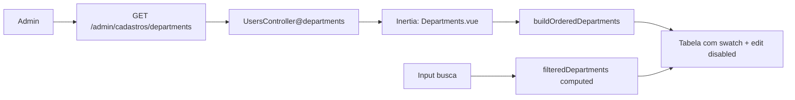

# Feature: admin-cadastros-departamentos

> Contexto: Tela de listagem dos departamentos (roles) do sistema no painel admin, dentro do módulo Cadastros. Visualização em tabela alinhada à tela de Usuários.  
> Fluxo de implementação (IA): `docs/flow/depts/edicaoDepartamento.md`  
> Depende de: `features/cadastros.md`, `features/auth.md`, `docs/database/schema.md`  
> Roles com acesso: `admin` apenas  
> Stack: Inertia.js + Vue 3, Laravel controller  
> URL: `http://127.0.0.1:8000/admin/cadastros/departments`

---

## Objetivo

Exibir os **4 departamentos fixos** do sistema (seedados em `departments`) em formato de **tabela**, com o mesmo padrão visual da listagem de Usuários:

- Campo **Procurar departamento** (filtro client-side)
- Coluna **Cor** com swatch + valor hexadecimal
- Botão **Editar cor** por linha (fase 2 — ver `docs/flow/depts/edicaoDepartamento.md`)

Não há CRUD de departamentos nesta feature (criar/renomear/excluir). A cor é editável na fase 2.

### Regra técnica de CSS (obrigatória)

- CSS não deve ficar embutido dentro de `.vue`.
- Cada componente/página deve usar arquivo externo em `styles`, por exemplo: `<style scoped src="./styles/Departments.css"></style>`.
- Manter o mesmo padrão da tela de Usuários para legibilidade e manutenção.

---

## Layout

### Estrutura geral

```
┌─────────────────────────────────────────────────────────────────┐
│ [sidebar principal] │ topbar: Departamentos  [Procurar depto.] │
│ 52px                ├─────────────────────────────────────────│
│                     │ table-card                               │
│                     │ Nome departamento | Cor      | Ações     │
│                     │ Admin             | ● #993C1D | [edit ⊘] │
│                     │ Kitchen           | ● #E67E22 | [edit ⊘] │
│                     │ Financeiro        | ● #2B6CB0 | [edit ⊘] │
│                     │ Garçom            | ● #38A169 | [edit ⊘] │
└─────────────────────────────────────────────────────────────────┘
```

### Cabeçalho da página

- Título à esquerda: `Departamentos`
- À direita: apenas o campo de busca ( **sem** botão `Adicionar` — departamentos são fixos via seeder)
- Placeholder do input: **`Procurar departamento`**

Layout textual esperado:

`Departamentos                              Procurar departamento`

### Tabela de departamentos

| Coluna | Conteúdo |
|--------|----------|
| Nome departamento | `label` enriquecido (Admin, Kitchen, Financeiro, Garçom) |
| Cor | Swatch circular + código hex (`#993C1D`) |
| Ações | Ícone lápis — **Editar cor** (desabilitado) |

Cabeçalho:

`Nome departamento : Cor : Ações`

---

## Cores e `departmentOptions.js`

As cores padrão estão em `DEPARTMENT_META` (`resources/js/utils/departmentOptions.js`) e são persistidas em `departments.color` após a migration da fase 2. O frontend usa `resolveDepartmentColor()` com fallback para o meta:

```js
export const DEPARTMENT_ORDER = ['admin', 'kitchen', 'finance', 'waiter'];

export const DEPARTMENT_META = {
    admin: { label: 'Admin', color: '#993C1D' },
    kitchen: { label: 'Kitchen', color: '#E67E22' },
    finance: { label: 'Financeiro', color: '#2B6CB0' },
    waiter: { label: 'Garçom', color: '#38A169' },
};
```

### Paleta por slug

| Ordem | Label na UI | Slug (`departments.slug`) | Cor |
|------:|-------------|---------------------------|-----|
| 1 | Admin | `admin` | `#993C1D` |
| 2 | Kitchen | `kitchen` | `#E67E22` |
| 3 | Financeiro | `finance` | `#2B6CB0` |
| 4 | Garçom | `waiter` | `#38A169` |

> Mesma paleta usada em `docs/flow/auth/gestaoDepartamentosUsuario.md` (corzinha nos painéis de usuário).

### Enriquecimento no frontend

Usar `buildOrderedDepartments(props.departments)` para:

1. Ordenar linhas na ordem fixa `DEPARTMENT_ORDER` (não alfabética por `name` do banco)
2. Anexar `label` e `color` a cada item
3. Ignorar slugs desconhecidos (fallback de cor: `#5E6B7A`)

```js
import { computed, ref } from 'vue';
import { buildOrderedDepartments } from '../../../utils/departmentOptions';

const orderedDepartments = computed(() => buildOrderedDepartments(props.departments));

const search = ref('');

const filteredDepartments = computed(() => {
    if (!search.value.trim()) {
        return orderedDepartments.value;
    }

    const query = search.value.toLowerCase();

    return orderedDepartments.value.filter((department) => (
        String(department.label ?? '').toLowerCase().includes(query)
        || String(department.slug ?? '').toLowerCase().includes(query)
    ));
});
```

O slug **não** aparece como coluna na tabela, mas entra na busca.

---

## Busca (client-side)

Espelhar o padrão de `filteredUsers` em `Users.vue`:

| Situação | Mensagem |
|----------|----------|
| Busca sem correspondência | `Nenhum departamento encontrado.` |
| Backend retorna lista vazia | `Nenhum departamento cadastrado.` |

Campos filtrados (case-insensitive): `label`, `slug`.

---

## Botão Editar cor (fase 2)

Implementado em `docs/flow/depts/edicaoDepartamento.md`:

- Botão habilitado abre `DepartmentColorEditPanel` (modal `admin-modal`)
- `PUT /admin/cadastros/departments/{id}` persiste em `departments.color`
- `getDepartments()` retorna `color` para Usuários e Departamentos

---

## Regras de negócio

- Apenas `admin` acessa (`firebase.auth`, `role:admin`)
- Departamentos são **somente leitura** nesta tela
- Os 4 registros vêm do `DepartmentSeeder`; sem interface de criar/renomear/excluir
- Vinculação usuário ↔ departamento permanece em Cadastros > Usuários (`PUT .../users/{user}/departments`)

---

## Fluxo de dados



---

## Rotas

| Método | URI | Controller@method | Middleware |
|--------|-----|-------------------|------------|
| GET | `/admin/cadastros/departments` | `Admin\UsersController@departments` | `firebase.auth`, `role:admin` |

```php
// routes/web.php (trecho existente)
Route::get('/departments', [UsersController::class, 'departments'])->name('departments.index');
```

---

## Implementação — backend

Sem alteração obrigatória nesta fase.

```php
<?php
// app/Http/Controllers/Admin/UsersController.php

public function departments(): Response
{
    return Inertia::render('Admin/Cadastros/Departments', [
        'departments' => $this->getDepartments(),
    ]);
}

private function getDepartments(): array
{
    return DB::table('departments')
        ->orderBy('name')
        ->get(['id', 'name', 'slug'])
        ->map(fn (object $department): array => [
            'id' => (string) $department->id,
            'name' => (string) $department->name,
            'slug' => (string) $department->slug,
            'label' => $this->formatDepartmentLabel(
                (string) $department->slug,
                (string) $department->name
            ),
        ])
        ->values()
        ->all();
}
```

Melhoria futura: retornar `color` quando existir coluna no banco.

---

## Implementação — frontend

### Estrutura de arquivos

```
resources/js/
  Pages/
    Admin/
      Cadastros/
        Departments.vue              ← tela principal
        styles/
          Departments.css
  Components/
    DepartmentsTableRow.vue        ← linha da tabela
    styles/
      DepartmentsTableRow.css
  utils/
    departmentOptions.js           ← DEPARTMENT_META, buildOrderedDepartments
```

### `Departments.vue` — estrutura

```vue
<script setup>
import { computed, ref } from 'vue';
import AppSidebar from '../../../Components/AppSidebar.vue';
import DepartmentsTableRow from '../../../Components/DepartmentsTableRow.vue';
import { buildOrderedDepartments } from '../../../utils/departmentOptions';

const props = defineProps({
    departments: { type: Array, default: () => [] },
});

const search = ref('');
const orderedDepartments = computed(() => buildOrderedDepartments(props.departments));

const filteredDepartments = computed(() => {
    if (!search.value.trim()) return orderedDepartments.value;
    const query = search.value.toLowerCase();
    return orderedDepartments.value.filter((d) =>
        String(d.label ?? '').toLowerCase().includes(query)
        || String(d.slug ?? '').toLowerCase().includes(query)
    );
});
</script>

<template>
  <motion>
    <!-- AppSidebar + topbar com search + table-card + DepartmentsTableRow -->
  </motion>
</template>

<style scoped src="./styles/Departments.css"></style>
```

### `DepartmentsTableRow.vue` — linha

- Célula nome: `department.label` (font-weight 600)
- Célula cor: `.color-swatch` com `background: department.color` + texto hex
- Célula ações: botão lápis `disabled`, `title="Editar cor (em breve)"`

Grid da linha (alinhado ao header):

```css
grid-template-columns: minmax(200px, 1fr) minmax(160px, 0.8fr) 80px;
```

---

## Design tokens

| Token | Valor |
|-------|-------|
| Fundo da página | `#f6f7f9` |
| Topbar | `52px`, borda `#eceef0` |
| Título seção | `20px / 600` |
| Input busca | altura `36px`, `border-radius: 8px`, `min-width: 220px` |
| Table card | fundo `#fff`, `border-radius: 14px`, borda `#eceef0` |
| Header tabela | `12px / 600 / uppercase`, cor `#7b7f89` |
| Swatch | círculo `14px`, borda `1px solid rgb(0 0 0 / 8%)` |
| Hex na coluna cor | `13px`, cor `#5f6572`, monospace opcional |

### Ícone de ação

| Ação | Ícone | Cor | Estado atual |
|------|-------|-----|--------------|
| Editar cor | lápis | `#1E6AD6` | `disabled`, opacidade ~0.4 |

---

## Estados de interface

- **Lista vazia (backend):** `Nenhum departamento cadastrado.`
- **Busca sem match:** `Nenhum departamento encontrado.`
- **Loading skeleton:** opcional (dados vêm no primeiro paint do Inertia); não obrigatório nesta fase

---

## O que NÃO está nesta feature

- Salvar ou editar cor (botão apenas desabilitado na UI)
- CRUD de departamentos (criar, renomear, excluir)
- Migration `departments.color`
- Paginação server-side
- Gestão de usuários nesta tela
- Coluna `slug` visível na tabela

---

## Status de implementação

- [x] `departamentos.md` publicado
- [x] `docs/flow/depts/edicaoDepartamento.md` publicado
- [ ] `Departments.vue` com layout tipo Usuários
- [ ] `DepartmentsTableRow.vue` + CSS externo
- [ ] Busca `Procurar departamento` funcional
- [ ] Cores visíveis por linha (swatch + hex)
- [x] Botão Editar cor habilitado (fase 2 — `edicaoDepartamento.md`)
- [ ] Ordem fixa admin → kitchen → finance → waiter
- [ ] `Departments.css` alinhado a `Users.css`
