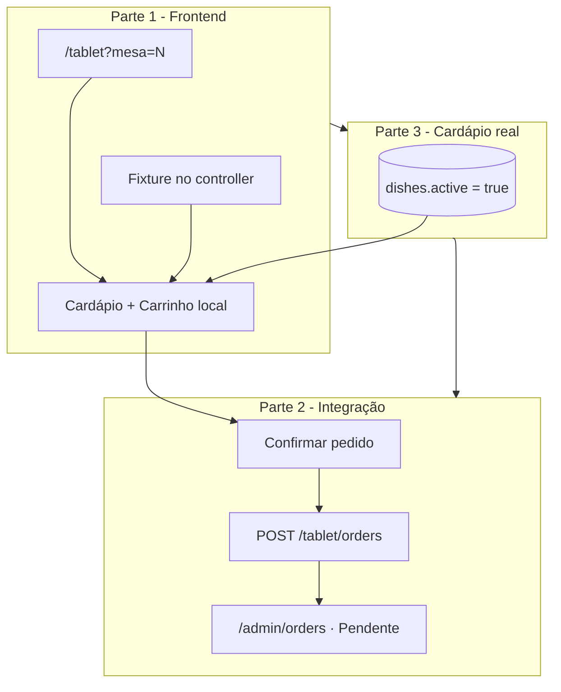

# SPEC: Tela Tablet — Pedido na Mesa

> **Contexto:** Interface pública do cliente na mesa (tablet físico ou navegador no computador) para montar o pedido a partir do cardápio e, nas fases seguintes, enviar à cozinha.
>
> **Depende de:** `docs/database/schema.md`, `docs/features/cadastroPratos.md`, `docs/features/pedidos.md`, `docs/project_overview.md` §3.7
>
> **Stack:** Inertia.js + Vue 3 (mesma stack do painel), layout dedicado **sem** sidebar admin
>
> **URL de acesso:** `http://127.0.0.1:8000/tablet?mesa={number}`

---

## Visão geral

O restaurante disponibiliza um dispositivo por mesa (tablet) ou o cliente usa o próprio computador com a mesma URL. O fluxo é:

1. Abrir a URL com o número da mesa
2. Navegar pelo cardápio, adicionar itens ao carrinho (quantidade + observação opcional)
3. Confirmar o pedido
4. O pedido aparece na **tela Pedidos** do admin (`/admin/orders`), coluna **Pendente**, para a cozinha operar

O desenvolvimento é **incremental em três partes**. Nesta SPEC, a **Parte 1** é o escopo imediato (somente frontend). As Partes 2 e 3 são lógica/backend e estão especificadas para implementação posterior, sem bloquear o início da Parte 1.

---

## Roadmap

| Parte | Escopo | Quando |
|-------|--------|--------|
| **1** | Frontend completo: layout responsivo (tablet + desktop), cardápio mock, carrinho local, confirmar **sem** persistência | **Agora** |
| **2** | `POST /tablet/orders` → pedido real em `/admin/orders` (coluna Pendente) | Depois |
| **3** | Cardápio real: todos os pratos **cadastrados e ativos** vêm do banco | Depois (pode ser antes ou depois da Parte 2; recomendado **antes** da Parte 2 para testes realistas) |



---

## Regras de negócio (transversais)

| Regra | Detalhe |
|-------|---------|
| **Mesa** | Identificada por `?mesa={1-99}` na URL; **obrigatória** — sem mesa válida, exibir tela de erro |
| **Autenticação** | Rota **pública** (sem Firebase); o cliente na mesa não faz login |
| **Cardápio no tablet** (Parte 3) | Apenas pratos com `dishes.active = true`; inativos **não** aparecem (alinhar com `DishCreatePanel`: *"Inativos não aparecem no tablet"*) |
| **Pedido** (Parte 2) | `orders.origin = 'table'`, `orders.status = 'pending'`, `orders.paid = false`, `table_id` resolvido por `tables.number = mesa` |
| **Observação por item** | Máximo **200** caracteres (`order_items.note`) |
| **Preço no carrinho** | Snapshot do preço no momento do **adicionar** ao carrinho; na Parte 2 persistir em `order_items.unit_price` (nunca usar preço atual do prato na exibição histórica) |
| **Carrinho vazio** | Botão "Confirmar pedido" **desabilitado** |
| **Múltiplos pedidos** | Cada confirmação (Parte 2) gera um **novo** `order`; o cliente pode pedir de novo após enviar |

---

## Dispositivos e ferramentas de UI

A tela deve funcionar de forma **totalmente utilizável** em:

- **Tablet** (touch, retrato e paisagem, ~768px–1024px)
- **Computador** (mouse + teclado, viewport larga)

Não usar layout exclusivo de admin (sidebar 52px). Layout próprio, otimizado para toque e leitura à distância.

### Breakpoint principal

| Viewport | Comportamento |
|----------|----------------|
| **`>= 1024px`** (desktop / tablet landscape largo) | **Split view:** ~65% cardápio \| ~35% carrinho fixo à direita |
| **`< 1024px`** (tablet portrait, celular) | Cardápio em largura total; carrinho em **drawer** acionado por FAB fixo `Ver pedido (N)` |

### Touch e acessibilidade (obrigatório)

| Requisito | Valor / nota |
|-----------|----------------|
| Área mínima de toque | **44×44 px** em botões, steppers (+/−), FAB e chips |
| Hover | Cards e CTAs **não** dependem de hover; estados visíveis sem mouse (`@media (hover: none)`) |
| `aria-label` | Adicionar, remover, abrir/fechar carrinho, confirmar |
| Contraste | Texto legível sobre fundo claro; botão primário escuro `#1a1a1a` |
| Scroll | Lista de categorias (chips) com scroll horizontal; grid de pratos com scroll vertical na área do cardápio |
| Teclado (desktop) | Modal de observação: foco no textarea; Esc fecha; Enter não envia pedido sozinho |

### Design tokens (alinhar ao admin / cadastro de pratos)

| Token | Valor |
|-------|-------|
| Fundo da página | `#f5f6f8` |
| Cards | `#ffffff`, borda `#eceef0` |
| Chip / categoria ativa | `#E67E22` (laranja) |
| Botão primário | `#1a1a1a`, texto branco |
| Tipografia | Mesma família do painel (herdar `app.css` global) |

### CSS (regra do projeto)

- **Proibido** CSS embutido longo em `.vue`
- Cada página/componente: `<style scoped src="./styles/NomeArquivo.css"></style>`
- Seguir padrão de `Dishes.vue`, `Users.vue`, etc.

### Componentes reutilizáveis

| Componente existente | Uso no tablet |
|---------------------|---------------|
| `DishCategoryChip.vue` | Filtro por categoria (chip "Todos" + chips por menu) |
| — | Demais componentes são **específicos** do tablet (prefixo `Tablet*`) |

---

## Parte 1 — Frontend (escopo atual)

### Objetivo

Entregar a experiência completa de **montar pedido** no navegador: cardápio, filtro por categoria, adicionar/remover quantidade, observação por item, total em BRL e fluxo de confirmação com feedback visual. **Sem** chamada HTTP de criação de pedido.

### Rota e controller

| Item | Valor |
|------|-------|
| Método / URI | `GET /tablet?mesa={number}` |
| Nome da rota | `tablet.order` |
| Middleware | **Nenhum** de autenticação Firebase |
| Controller | `App\Http\Controllers\Tablet\TabletOrderController@index` |
| Page Inertia | `Pages/Tablet/Order.vue` |
| Erro de mesa | `Pages/Tablet/MissingMesa.vue` quando `mesa` ausente, não numérica ou fora de `1..99` |

**Validação backend da mesa (obrigatória na Parte 1):**

- Query `mesa` presente
- Inteiro entre `1` e `99` (inclusive)
- Caso inválido: renderizar `MissingMesa.vue` (não `Order.vue`)

> Na Parte 1 **não** é obrigatório validar se a mesa existe em `tables` — apenas o formato do número. Na Parte 2, mesa inexistente retorna erro 422.

### Layout (`TabletLayout.vue`)

- Header fixo: **`4Food · Mesa {N}`** (N = valor de `mesa` validado)
- Sem sidebar, sem topbar admin
- Slot para conteúdo da página
- Altura útil: `100vh` / `100dvh` onde suportado; evitar scroll duplo no body

### Wireframe — desktop (`>= 1024px`)

```
┌─────────────────────────────────────────────────────────────────┐
│  4Food · Mesa 12                                                │
├────────────────────────────────────┬────────────────────────────┤
│  [Todos] [Burger] [Bebidas] … →    │  Seu pedido                │
│                                      │                            │
│  ┌────────┐ ┌────────┐ ┌────────┐ │  2× Burger      R$ 45,00   │
│  │  foto  │ │  foto  │ │  foto  │ │      obs: sem cebola       │
│  │  nome  │ │  nome  │ │  nome  │ │  [−] 2 [+]  [Editar obs]    │
│  │ R$ …   │ │ R$ …   │ │ R$ …   │ │  ─────────────────────────  │
│  │ [ + ]  │ │ [−][2][+]│ │ [ + ]  │ │  Total          R$ 45,00   │
│  └────────┘ └────────┘ └────────┘ │  [ Confirmar pedido ]      │
│         (grid responsivo)            │                            │
└────────────────────────────────────┴────────────────────────────┘
```

### Wireframe — mobile / tablet estreito (`< 1024px`)

```
┌──────────────────────────────┐
│  4Food · Mesa 12             │
├──────────────────────────────┤
│  [Todos] [Burger] …          │
│  ┌────┐ ┌────┐               │
│  │card│ │card│  …            │
│  └────┘ └────┘               │
│                              │
│         ┌──────────────────┐ │
│         │ Ver pedido (3)   │ │  ← FAB fixo inferior
│         └──────────────────┘ │
└──────────────────────────────┘

(drawer sobrepõe cardápio ao abrir o carrinho)
```

### Props Inertia — `Order.vue`

```php
[
    'mesa' => 12,                    // int validado
    'categories' => [
        [
            'id' => 'uuid',
            'name' => 'Burger',
            'slug' => 'burger',
            'dishes_count' => 3,     // contagem para o chip (Parte 1: do mock)
        ],
    ],
    'dishes' => [
        [
            'id' => 'uuid',
            'name' => 'Chicken Deluxe Burger',
            'description' => '...',  // nullable
            'price' => 32.90,        // float; exibição com formatPriceBRL
            'photo_url' => '/storage/...' | null,
            'category_id' => 'uuid',
            'category_name' => 'Burger',
        ],
    ],
]
```

**Parte 1 — origem dos dados:** fixture estática no `TabletOrderController` (não consultar banco). Sugestão de mock:

- 3 categorias, 7 pratos
- Pelo menos 1 prato **sem** `description` (testar UI sem texto)
- Pelo menos 1 prato **sem** `photo_url` (placeholder visual)
- Preços variados para validar total

### Cardápio (área esquerda / principal)

| Elemento | Comportamento |
|----------|----------------|
| Chips | "Todos" + um chip por categoria; reutilizar `DishCategoryChip`; contagem `dishes_count` no chip |
| Filtro | **Client-side** por `category_id`; chip "Todos" mostra todos |
| Grid | CSS Grid: `minmax(160px, 1fr)` ou similar; gap consistente |
| Card do prato (`TabletDishCard`) | Foto (ou placeholder), nome, preço BRL, descrição truncada (2 linhas) se existir |
| CTA no card | Se quantidade no carrinho = 0: botão **Adicionar**; se > 0: stepper **−** / quantidade / **+** |
| Adicionar | Cria linha no carrinho com `quantity = 1`, `note = ''`, `unitPrice = dish.price` |

### Carrinho (área direita ou drawer)

**Estado local (Vue `ref` / `reactive`) — não persiste em servidor na Parte 1:**

```ts
type CartLine = {
  dishId: string;
  name: string;
  unitPrice: number;
  quantity: number;
  note: string;   // max 200 chars
};
```

| Ação | Comportamento |
|------|----------------|
| Adicionar (do card) | Nova linha ou incrementa `quantity` da linha existente (`dishId`) |
| Stepper − na linha | Se `quantity === 1`, remove a linha; senão decrementa |
| Stepper + na linha | Incrementa `quantity` |
| Editar observação | Abre `TabletItemNoteModal`; salvar atualiza `note`; contador `N/200` |
| Total | `Σ (quantity × unitPrice)` formatado em BRL (`formatPriceBRL` — reutilizar helper do projeto se existir) |
| Confirmar | Ver fluxo abaixo |
| Carrinho vazio | Mensagem "Seu pedido está vazio"; botão confirmar desabilitado |

### Fluxo "Confirmar pedido" (Parte 1 apenas UI)

1. Usuário clica **Confirmar pedido** (habilitado só se `cart.length > 0`)
2. Abre modal de confirmação: resumo (N itens, total BRL, mesa)
3. Botão **Enviar para cozinha** (ou equivalente)
4. Ao confirmar no modal: **não** chamar API; exibir mensagem do tipo *"Pedido registrado localmente. Integração com a cozinha na próxima etapa."*
5. Limpar carrinho e fechar drawer (mobile)

### Componentes a criar (Parte 1)

| Arquivo | Responsabilidade |
|---------|------------------|
| `Layouts/TabletLayout.vue` | Header mesa + slot |
| `Pages/Tablet/Order.vue` | Orquestra cardápio, carrinho, drawer, modais |
| `Pages/Tablet/MissingMesa.vue` | Instrução: usar URL com `?mesa=1` etc. |
| `Components/TabletDishCard.vue` | Card de prato + CTA/stepper |
| `Components/TabletCart.vue` | Lista, total, botão confirmar |
| `Components/TabletCartLine.vue` | Uma linha do carrinho |
| `Components/TabletItemNoteModal.vue` | Textarea observação |
| `Components/styles/Tablet*.css` | Estilos externos por componente |

### Arquivos backend (Parte 1)

| Arquivo | Ação |
|---------|------|
| `routes/web.php` | Registrar `GET /tablet` **fora** do grupo `firebase.auth` |
| `app/Http/Controllers/Tablet/TabletOrderController.php` | `index`: validar mesa + retornar mock Inertia |

### Fora de escopo na Parte 1

- `POST` / `PATCH` de pedidos
- Alterações em `Admin\OrdersController`, models `Order` / `OrderItem`
- Firebase, sessão, QR code
- WebSocket / broadcasting
- Validação de mesa existente no banco
- Consulta real a `dishes` / `dish_categories`

### Critérios de aceite — Parte 1

- [ ] `GET /tablet?mesa=12` renderiza cardápio mock com header "Mesa 12"
- [ ] `/tablet` ou `?mesa=abc` ou `?mesa=0` → `MissingMesa.vue`
- [ ] Desktop: split cardápio + carrinho fixo
- [ ] `< 1024px`: FAB abre drawer com carrinho
- [ ] Filtro por chip funciona sem reload
- [ ] Adicionar, stepper, observação (max 200), total BRL corretos
- [ ] Confirmar limpa carrinho e mostra feedback **sem** POST
- [ ] Touch targets ≥ 44px; `aria-label` nos controles principais
- [ ] CSS em arquivos externos em todos os `.vue` do tablet

---

## Parte 2 — Integração com Tela Pedidos (futuro)

### Objetivo

Ao confirmar no tablet/computador, **persistir** `orders` + `order_items` e o pedido deve aparecer imediatamente (após reload ou via broadcasting futuro) na coluna **Pendente** de **`/admin/orders`** — mesma estrutura consumida por `OrderCard.vue` e `Admin/Orders.vue`.

> **Importante:** Este é o elo entre o cliente na mesa e a operação da cozinha/admin. Sem a Parte 2, o tablet é apenas simulação local.

### Rota sugerida

| Item | Valor |
|------|-------|
| Método / URI | `POST /tablet/orders` |
| Auth | Pública (sem Firebase) |
| Controller | `TabletOrderController@store` (ou `TabletOrderStoreController`) |

**Body JSON:**

```json
{
  "mesa": 12,
  "items": [
    {
      "dish_id": "uuid-do-prato",
      "quantity": 2,
      "note": "Sem cebola"
    }
  ]
}
```

**Validação:**

| Campo | Regra |
|-------|-------|
| `mesa` | Obrigatório, inteiro 1–99, deve existir em `tables.number` |
| `items` | Array não vazio |
| `items.*.dish_id` | UUID existente, prato `active = true` |
| `items.*.quantity` | Inteiro ≥ 1 |
| `items.*.note` | Opcional, string, max 200 |

### Backend — transação

1. Resolver `tables.id` onde `tables.number = mesa` → senão **422** `"Mesa não encontrada"`
2. `DB::transaction`:
   - Criar `orders`: `table_id`, `origin = 'table'`, `status = 'pending'`, `paid = false`
   - Para cada item: criar `order_items` com `dish_id`, `quantity`, `note`, `unit_price = dishes.price` **no momento do pedido**
3. Retornar JSON ou redirect Inertia com `{ order_id, message }`

### Shape esperado na Tela Pedidos

Compatível com o array já usado em `Admin\OrdersController` / `OrderCard.vue`:

```php
[
    'id' => 'ped-1221',           // ou formatação #ped-XXXX a partir do UUID
    'mesa' => 'Mesa 12',          // tables.label ?? "Mesa {number}"
    'items' => [
        ['qty' => 2, 'name' => 'Burger', 'note' => 'Sem cebola'],
    ],
    'note_summary' => '- Sem cebola',  // concatenação das notes não vazias
]
```

**Regra `note_summary`:** juntar notes dos itens com prefixo `- ` ou `– `, separadas por vírgula ou quebra visual; se todas vazias, `null`.

### Frontend tablet pós-Parte 2

| Comportamento | Detalhe |
|---------------|---------|
| Confirmar | `POST /tablet/orders` com `mesa` + itens do carrinho |
| Loading | Desabilitar botão e mostrar spinner durante request |
| Sucesso | Limpar carrinho; toast/modal: *"Pedido enviado para a cozinha"* |
| Erro 422 | Exibir mensagens (mesa inválida, prato inativo, etc.) |
| Erro rede | Manter carrinho; permitir tentar novamente |

### Atualização da Tela Pedidos

- `Admin\OrdersController@index` deve passar de fixture para **query real** (ou mesclar: Parte 2 do tablet + query no admin na mesma entrega)
- Novos pedidos com `status = pending` entram na coluna **Pendente**
- Filtro de busca por nome de prato no admin continua funcionando com os nomes vindos de `order_items` → `dishes`

### Opcional (não bloqueante)

- Laravel Broadcasting / Reverb para atualizar kanban sem reload
- Rate limit leve em `POST /tablet/orders` por IP

### Critérios de aceite — Parte 2

- [ ] Confirmar no tablet cria registro em `orders` e `order_items`
- [ ] Pedido visível em `/admin/orders` → coluna Pendente
- [ ] `origin = table`, `status = pending`
- [ ] `unit_price` congelado no momento do pedido
- [ ] Mesa inexistente ou carrinho vazio retorna erro claro
- [ ] Prato inativo rejeitado no POST mesmo que ainda esteja no carrinho local

---

## Parte 3 — Cardápio real (futuro)

### Objetivo

**Tudo que for prato cadastrado e ativo** no admin (`/admin/cadastros/dishes`) deve aparecer no tablet para pedido. Substituir o fixture da Parte 1 por dados do banco.

### Regra de visibilidade

| Condição no admin | Aparece no tablet? |
|-------------------|-------------------|
| `dishes.active = true` | Sim |
| `dishes.active = false` | Não |
| Prato excluído | Não |
| Categoria sem pratos ativos | Chip pode ficar oculto ou com contagem 0 (definir: ocultar chips com `dishes_count = 0`) |

### Query sugerida (controller `index`)

```sql
SELECT
  dishes.id,
  dishes.name,
  dishes.description,
  dishes.price,
  dishes.photo_path,
  dishes.category_id,
  dish_categories.name AS category_name
FROM dishes
INNER JOIN dish_categories ON dish_categories.id = dishes.category_id
WHERE dishes.active = true
ORDER BY dish_categories.name ASC, dishes.name ASC
```

**Categorias para chips:**

```sql
SELECT dish_categories.*, COUNT(dishes.id) AS dishes_count
FROM dish_categories
LEFT JOIN dishes ON dishes.category_id = dish_categories.id AND dishes.active = true
GROUP BY dish_categories.id
HAVING dishes_count > 0   -- opcional: esconder menus vazios
ORDER BY dish_categories.name
```

### `photo_url`

- Se `photo_path` preenchido: `Storage::url($dish->photo_path)` (mesmo padrão do admin em `Dishes.vue`)
- Se null: placeholder no `TabletDishCard` (ícone ou cor neutra)

### Sincronização com cadastro de pratos

| Ação no admin | Efeito no tablet |
|---------------|------------------|
| Criar prato ativo | Aparece após reload da página tablet |
| Desativar prato | Some após reload |
| Alterar preço | Novo preço só para **novos** adds ao carrinho; linhas já no carrinho mantêm `unitPrice` anterior |
| Alterar categoria | Prato move de chip após reload |
| Excluir prato | Some; POST Parte 2 não aceita mais esse `dish_id` |

### Ordem de implementação recomendada

1. Parte 1 (UI + mock)
2. **Parte 3** (cardápio real) — permite testar fluxo visual com dados reais
3. **Parte 2** (POST + Tela Pedidos)

Alternativa aceitável: Parte 2 + 3 na mesma entrega, desde que o POST valide `active = true`.

### Critérios de aceite — Parte 3

- [ ] Nenhum prato inativo listado no tablet
- [ ] Todos os pratos ativos do banco aparecem
- [ ] Chips e contagem batem com pratos ativos por categoria
- [ ] Fotos e preços iguais ao cadastro admin
- [ ] Cardápio vazio (sem pratos ativos): estado vazio amigável no tablet

---

## Mapa de arquivos (todas as partes)

| Arquivo | Parte |
|---------|-------|
| `routes/web.php` | 1: GET `/tablet`; 2: POST `/tablet/orders` |
| `app/Http/Controllers/Tablet/TabletOrderController.php` | 1: index + mock; 2: store; 3: query real no index |
| `resources/js/Layouts/TabletLayout.vue` | 1 |
| `resources/js/Pages/Tablet/Order.vue` | 1 (+ POST na 2) |
| `resources/js/Pages/Tablet/MissingMesa.vue` | 1 |
| `resources/js/Components/Tablet*.vue` | 1 |
| `app/Http/Controllers/Admin/OrdersController.php` | 2: dados reais no kanban |
| Models / migrations | Já existentes em `schema.md` — **não** criar novas tabelas para o tablet |

---

## Referências cruzadas

| Documento | Relação |
|-----------|---------|
| `cadastroPratos.md` | Origem dos pratos e categorias; flag `active` |
| `pedidos.md` / `Admin/Orders.vue` | Destino do pedido (Parte 2) |
| `schema.md` | `tables`, `dishes`, `orders`, `order_items` |
| `project_overview.md` §3.7 | Visão produto do módulo tablet |

---

## Glossário

| Termo | Significado |
|-------|-------------|
| **Menu** | `dish_categories` (ex.: Burger, Bebidas) |
| **Prato** | `dishes` |
| **Mesa** | `tables.number` via query `?mesa=` |
| **Tela Pedidos** | `/admin/orders` — kanban Pendente / Preparando / Finalizados |
