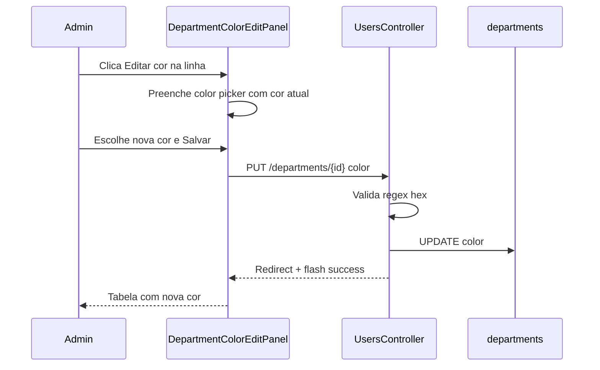

# Fluxo: Edição de cor do departamento (Admin > Cadastros > Departamentos)

> **Tipo:** spec de implementação para IA  
> **Escopo:** editar **apenas a cor** de um departamento fixo. Nome e slug **não** são editáveis.  
> **Pré-requisito:** listagem em tabela documentada em `docs/features/departamentos.md` (fase 1).  
> **Depende de:** `docs/features/departamentos.md`, `docs/features/cadastros.md`, `docs/database/schema.md`, `docs/flow/auth/gestaoDepartamentosUsuario.md`  
> **Rota a criar:** `PUT /admin/cadastros/departments/{department}` → `UsersController@updateDepartmentColor`  
> **URL da listagem:** `http://127.0.0.1:8000/admin/cadastros/departments`

---

## Objetivo

Permitir que o admin altere a **cor visual** de um departamento a partir do ícone **Editar cor** (lápis) na listagem. A interface reutiliza o **mesmo painel/modal** do cadastro de usuário (`UserCreatePanel` / classes `admin-modal`), mas exibe **somente um campo**: a cor escolhida pelo usuário.

| Campo na UI | Campo persistido | Editável |
|-------------|------------------|----------|
| Cor do departamento | `departments.color` | Sim (via color picker) |
| Nome / slug | `departments.name`, `departments.slug` | Não (somente leitura no subtítulo) |

Após salvar, a tabela de departamentos e qualquer UI que use `department.color` do backend deve refletir a nova cor — em especial **Gerir departamentos** na listagem de usuários, que deve mostrar a **mesma cor** que a tela Cadastros > Departamentos.

---

## Gatilho

1. Admin acessa `/admin/cadastros/departments`.
2. Na
TableRow` emite `edit`).
3. Abre o **mesmo menu modal** usado em “Adicionar usuário” (`admin-modal-overlay` + `admin-modal`), com título e um único campo de cor.

Na fase 1 o botão está `disabled`. **Habilitar** e ligar a este fluxo.

---

## UI — painel de edição (mesmo shell do cadastro de usuário)

### Reutilização visual obrigatória

Espelhar `UserCreatePanel.vue` + `resources/js/Components/styles/AdminModal.css` (importado globalmente em `resources/js/app.js`):

- Overlay `admin-modal-overlay` — clique fora fecha e descarta
- `section.admin-modal` centralizado — `role="dialog"`, `aria-modal="true"`
- `header.admin-modal-head` com título (e subtítulo opcional)
- `form.admin-modal-form` com **um** `admin-modal-field`
- `footer.admin-modal-actions` com **Sair** (`secondary`) e **Salvar** (`primary`)
- Tecla `Esc` fecha (mesmo padrão `onMounted` / `onUnmounted` do create)
- **Não** embutir CSS no `.vue` — usar `AdminModal.css` + CSS específico mínimo em arquivo externo se necessário (ex. layout do color picker)

### Conteúdo do painel

| Elemento | Valor |
|----------|--------|
| Título | `Editar cor do departamento` |
| Subtítulo no header (opcional, recomendado) | `{{ department.label }}` — texto secundário (`admin-modal-head p`), **somente leitura** |
| **Único campo editável** | Cor do departamento — escolha visual pelo usuário |
| Botão Sair | Fecha modal, reseta form e limpa erros |
| Botão Salvar | Envia `PUT` (desabilitado se sem alteração ou `processing`) |

### Campo “Cor do departamento” (escolha do usuário)

A cor deve ser alterada **pela escolha do usuário**, não por valor fixo em código.

| Requisito | Detalhe |
|-----------|---------|
| Controle principal | `<input type="color">` nativo do HTML5 |
| Label | Floating label `Cor do departamento` (mesma classe `admin-modal-floating-label`) |
| Preview | Swatch circular `14px` + texto hex (`#993C1D`) ao lado, atualizado em tempo real |
| Valor inicial | `department.color` da linha (banco ou fallback `DEPARTMENT_META`) |
| Formato | Hex `#RRGGBB` (normalizar uppercase ao salvar) |

Estrutura sugerida:

```vue
<label class="admin-modal-field">
    <div class="admin-modal-input-wrap admin-modal-color-field">
            <span class="admin-modal-floating-label">Cor do departamento</span>
            <input
                v-model="form.color"
                type="color"
                :aria-label="`Cor do departamento ${department.label}`"
            >
            <span
                class="color-preview-swatch"
                :style="{ background: form.color }"
                aria-hidden="true"
            />
            <span class="color-preview-hex">{{ form.color }}</span>
    </div>
    <small v-if="form.errors.color">{{ form.errors.color }}</small>
</label>
```

CSS do color field (arquivo externo, ex. `DepartmentColorEditPanel.css`):

- `input[type="color"]`: largura ~`48px`, altura ~`36px`, sem borda agressiva, cursor pointer
- Preview hex: `13px`, cor `#5f6572`, monospace opcional
- Manter alinhamento com `admin-modal-input-wrap` (padding, focus border `#993c1d`)

**Não incluir** no painel: nome editável, slug, select de departamento, senha, e-mail.

### Comportamento do formulário

```js
import { useForm } from '@inertiajs/vue3';
import { computed } from 'vue';

function normalizeHex(value) {
    const hex = String(value ?? '').trim().toUpperCase();
    return /^#[0-9A-F]{6}$/.test(hex) ? hex : '';
}

const form = useForm({
    color: normalizeHex(props.department.color) || '#5E6B7A',
});

const initialColor = normalizeHex(props.department.color);

const hasChanges = computed(() =>
    normalizeHex(form.color) !== initialColor
);
```

- **Salvar** desabilitado se `!hasChanges` ou `form.processing`.
- Fechar com overlay, `Esc` ou **Sair** descarta alterações (reset + `clearErrors`).
- Erros de validação Inertia em `form.errors.color`.

### Componentização sugerida

| Arquivo | Papel |
|---------|--------|
| `DepartmentColorEditPanel.vue` | Painel espelhando `UserCreatePanel` — só cor + ações |
| `resources/js/Components/styles/DepartmentColorEditPanel.css` | Estilos do color picker / preview (opcional) |
| `Departments.vue` | Estado `editPanelDepartment`, handlers, render condicional do painel |
| `DepartmentsTableRow.vue` | Remover `disabled`; `@click` emite `edit` com `department` |

---

## Regras de negócio

### O que pode ser editado

- Apenas **`departments.color`**.
- Os 4 departamentos são **fixos** (seed); sem criar, renomear ou excluir.

### Acesso

- Apenas usuário com `role:admin` (`firebase.auth`, middleware `role:admin`).

### Prioridade de cor na UI

| Fonte | Quando usar |
|-------|-------------|
| `departments.color` (banco) | Após migration e primeiro save |
| `DEPARTMENT_META[slug].color` | Fallback se `color` null (antes do backfill ou registro legado) |
| `#5E6B7A` | Slug desconhecido |

Frontend (`buildOrderedDepartments`):

```js
color: department.color ?? DEPARTMENT_META[slug]?.color ?? '#5E6B7A',
```

### Sincronização de cor — Gestão de departamento do usuário (obrigatório)

Na tela **Cadastros > Usuários**, ao clicar em **Gerir departamentos** (`DepartmentManagePanel`) e no **select de departamento** do cadastro (`DepartmentSelect`), a **corzinha** de cada departamento deve ser **exatamente a mesma** exibida na listagem **Cadastros > Departamentos** (`/admin/cadastros/departments`).

| Regra | Detalhe |
|-------|---------|
| Fonte única de verdade | `departments.color` no banco (após migration e save neste fluxo) |
| Mesma resolução no frontend | Reutilizar helper compartilhado (ex. `resolveDepartmentColor(department)` em `departmentOptions.js`) — **não** duplicar hex fixo por slug em cada componente |
| Ordem de fallback | `department.color` → `DEPARTMENT_META[slug].color` → `#5E6B7A` |
| Após editar cor em Departamentos | Ao reabrir “Gerir departamentos” ou recarregar Usuários, a corzinha já reflete o novo valor (props `departments` do `UsersController@index` incluem `color`) |

**Proibido:** manter tabela de cores hardcoded só em `gestaoDepartamentosUsuario.md` / `DepartmentManagePanel` desacoplada da tela de Departamentos. Se o admin mudar a cor de Financeiro para `#FF0000` em Departamentos, a corzinha de Financeiro em **Gerir departamentos** deve mostrar `#FF0000`, não o hex antigo do doc.

#### Implementação sugerida

1. `getDepartments()` retorna `color` em **todas** as rotas que enviam `departments` ao frontend (`departments.index` e `users.index`).
2. Extrair em `departmentOptions.js`:

```js
export function resolveDepartmentColor(department) {
    const slug = String(department?.slug ?? '').toLowerCase();
    const fromDb = department?.color ? String(department.color).toUpperCase() : '';
    if (/^#[0-9A-F]{6}$/.test(fromDb)) {
        return fromDb;
    }
    return DEPARTMENT_META[slug]?.color ?? '#5E6B7A';
}
```

3. Usar `resolveDepartmentColor(department)` em:
   - `DepartmentsTableRow.vue` (coluna Cor)
   - `DepartmentManagePanel.vue` (corzinha ao lado do checkbox)
   - `DepartmentSelect.vue` (indicador no dropdown, se houver)

#### Critérios de aceite — paridade de cor

- [ ] Alterar cor de um departamento em **Departamentos** e, sem alterar código, ver a **mesma** cor na corzinha em **Gerir departamentos** (após reload ou próximo `index` de usuários).
- [ ] `DepartmentSelect` no cadastro de usuário usa a mesma função/helper que a tabela de Departamentos.
- [ ] Nenhum componente de usuários mantém mapa de cores independente de `departmentOptions.js` / banco.

Ver também: `docs/flow/auth/gestaoDepartamentosUsuario.md` (atualizar tabela de cores fixas para referenciar `department.color` dinâmico).

---

## Integração backend

### Migration

Criar migration `add_color_to_departments_table`:

```php
Schema::table('departments', function (Blueprint $table) {
    $table->string('color', 7)->nullable()->after('slug');
});
```

**Backfill** dos 4 slugs (mesmos valores de `departmentOptions.js`):

| Slug | Cor |
|------|-----|
| `admin` | `#993C1D` |
| `kitchen` | `#E67E22` |
| `finance` | `#2B6CB0` |
| `waiter` | `#38A169` |

Após backfill, tornar coluna `NOT NULL` (recomendado).

Atualizar `docs/database/schema.md` com a coluna `color`.

### Rota

```php
// routes/web.php — dentro do grupo admin/cadastros
Route::put('/departments/{department}', [UsersController::class, 'updateDepartmentColor'])
    ->name('departments.updateColor');
```

### Request

```
PUT /admin/cadastros/departments/{department}
Content-Type: application/json (Inertia)

{
  "color": "#2B6CB0"
}
```

`{department}` = `departments.id` (string UUID do seeder).

### Validação (`UsersController@updateDepartmentColor`)

```php
$validated = $request->validate([
    'color' => ['required', 'string', 'regex:/^#[0-9A-Fa-f]{6}$/'],
]);

$normalizedColor = strtoupper($validated['color']);

$updated = DB::table('departments')
    ->where('id', $department)
    ->update(['color' => $normalizedColor]);

if ($updated === 0) {
    abort(404);
}

return redirect()
    ->route('admin.cadastros.departments.index')
    ->with('success', 'Cor do departamento atualizada com sucesso.');
```

### `getDepartments()` — incluir `color`

Estender o retorno existente:

```php
->get(['id', 'name', 'slug', 'color'])
// ...
'color' => $department->color
    ? strtoupper((string) $department->color)
    : $this->defaultColorForSlug((string) $department->slug),
```

Helper `defaultColorForSlug()` — match dos 4 slugs com hex de `DEPARTMENT_META`.

### Response

Redirect para `departments.index` + flash `success`. Listagem Inertia recarrega `departments` com `color` atualizado.

---

## Integração frontend (Inertia)

### `Departments.vue`

```js
const editPanelDepartment = ref(null);

function handleEditColor(department) {
    editPanelDepartment.value = department;
}

function closeColorPanel() {
    editPanelDepartment.value = null;
}
```

Template:

```vue
<DepartmentsTableRow
    v-for="department in filteredDepartments"
    :key="department.id"
    :department="department"
    @edit="handleEditColor"
/>

<DepartmentColorEditPanel
    v-if="editPanelDepartment"
    :department="editPanelDepartment"
    @close="closeColorPanel"
/>
```

Flash de sucesso (opcional, espelhar `Users.vue`):

```js
const flashSuccess = computed(() => page.props.flash?.success ?? '');
```

### `DepartmentsTableRow.vue`

```vue
<button
    type="button"
    class="icon-btn edit"
    title="Editar cor"
    :aria-label="`Editar cor do departamento ${department.label}`"
    @click="emit('edit', department)"
>
```

Remover: `disabled`, classe `.disabled`, texto `Editar cor (em breve)`.

### `DepartmentColorEditPanel.vue` — submit

```js
form.put(`/admin/cadastros/departments/${props.department.id}`, {
    preserveScroll: true,
    onSuccess: () => emit('close'),
});
```

Payload: `{ color: normalizeHex(form.color) }`.

---

## Arquivos a criar / alterar

| Arquivo | Ação |
|---------|------|
| `database/migrations/xxxx_add_color_to_departments_table.php` | **Criar** |
| `routes/web.php` | **Alterar** — rota `PUT departments/{department}` |
| `app/Http/Controllers/Admin/UsersController.php` | **Alterar** — `updateDepartmentColor`, `getDepartments` com `color` |
| `resources/js/Components/DepartmentColorEditPanel.vue` | **Criar** |
| `resources/js/Components/styles/DepartmentColorEditPanel.css` | **Criar** (opcional) |
| `resources/js/Pages/Admin/Cadastros/Departments.vue` | **Alterar** — estado do painel, flash |
| `resources/js/Components/DepartmentsTableRow.vue` | **Alterar** — habilitar botão, emit `edit` |
| `resources/js/utils/departmentOptions.js` | **Alterar** — `resolveDepartmentColor`, `buildOrderedDepartments` |
| `resources/js/Components/DepartmentManagePanel.vue` | **Alterar** — corzinha via `resolveDepartmentColor` (mesma cor que Departamentos) |
| `resources/js/Components/DepartmentSelect.vue` | **Alterar** — indicador de cor via `resolveDepartmentColor` |
| `docs/flow/auth/gestaoDepartamentosUsuario.md` | **Atualizar** — cores dinâmicas, não hex fixo na doc |
| `docs/database/schema.md` | **Atualizar** — coluna `color` |
| `docs/features/departamentos.md` | **Atualizar** — marcar fase 2 e link para este fluxo |

---

## Acessibilidade e UX

- `role="dialog"`, `aria-modal="true"`, `aria-labelledby` no título do painel.
- `input type="color"`: `aria-label` descritivo com nome do departamento.
- Swatch decorativo no preview: `aria-hidden="true"`; cor legível pelo hex ao lado.
- Botão lápis: `aria-label="Editar cor do departamento {label}"`.
- Loading: botão Salvar `Salvando...` e `:disabled="form.processing"`.
- Flash de sucesso na listagem após redirect.

---

## O que NÃO fazer nesta entrega

- Editar `name` ou `slug` do departamento.
- Criar, renomear ou excluir departamentos.
- CRUD de usuários nesta tela.
- Paginação ou busca server-side.
- Duplicar `DEPARTMENT_META` fora de `departmentOptions.js` (manter como fallback).
- Usar modal diferente do padrão `admin-modal` do cadastro de usuário.

---

## Casos de erro

| Erro | Comportamento esperado |
|------|------------------------|
| 422 validação (`color` inválido) | Modal permanece aberto; `form.errors.color` |
| Departamento inexistente | 404 |
| Sem alteração | Salvar desabilitado (`!hasChanges`) |

---

## Critérios de aceite (checklist para IA)

- [ ] Clicar em **Editar cor** abre modal com o mesmo visual do cadastro (`admin-modal-overlay` + `admin-modal`).
- [ ] Modal exibe **somente** o campo de cor (color picker + preview hex).
- [ ] Nome do departamento aparece só como subtítulo no header (não editável).
- [ ] Cor inicial = valor atual da linha (banco ou fallback meta).
- [ ] Usuário altera cor pelo **`<input type="color">`** (escolha visual).
- [ ] Preview swatch + hex atualizam ao mudar o picker.
- [ ] **Sair** / overlay / `Esc` fecham sem salvar.
- [ ] **Salvar** desabilitado se cor não mudou.
- [ ] **Salvar** chama `PUT /admin/cadastros/departments/{id}` com hex válido.
- [ ] Cor persiste em `departments.color`.
- [ ] Listagem recarrega; coluna Cor mostra swatch + hex novos.
- [ ] Botão lápis na tabela **habilitado** (`title`: `Editar cor`).
- [ ] Apenas `admin` acessa rota e painel.
- [ ] CSS do painel não embutido no `.vue` (AdminModal global + CSS externo se houver).
- [ ] **Gerir departamentos** e **DepartmentSelect** exibem a mesma cor que a tela Departamentos (`resolveDepartmentColor`).
- [ ] `getDepartments()` em `users.index` inclui `color` para paridade entre telas.

---

## Referência visual (wireframe ASCII)

Mesmo container do cadastro de usuário, com um único campo:

```
┌─────────────────────────────────────┐
│ Editar cor do departamento          │
│ Financeiro                          │
├─────────────────────────────────────┤
│ Cor do departamento                 │
│ [ ■ color picker ]  ●  #2B6CB0      │
├─────────────────────────────────────┤
│              [ Sair ] [ Salvar ]    │
└─────────────────────────────────────┘
```

Comparar com cadastro (mais campos):

```
┌─────────────────────────────────────┐
│ Cadastrar usuario                   │
├─────────────────────────────────────┤
│ Nome / Departamento / E-mail / Senha│
└─────────────────────────────────────┘
```

---

## Fluxo resumido (sequência)



---

## Paleta inicial (seed / fallback)

| Label | Slug | Cor padrão |
|-------|------|------------|
| Admin | `admin` | `#993C1D` |
| Kitchen | `kitchen` | `#E67E22` |
| Financeiro | `finance` | `#2B6CB0` |
| Garçom | `waiter` | `#38A169` |

Mesma paleta de `resources/js/utils/departmentOptions.js` e `gestaoDepartamentosUsuario.md`.

---

## Próximo passo (ordem de implementação)

1. Migration + backfill `departments.color`
2. Rota `PUT` + `UsersController@updateDepartmentColor`
3. `getDepartments()` retornando `color`
4. `DepartmentColorEditPanel.vue` + integração em `Departments.vue`
5. Habilitar botão em `DepartmentsTableRow.vue`
6. Atualizar `buildOrderedDepartments` para priorizar banco
7. Teste manual: alterar cor, recarregar página, confirmar persistência e preview na tabela

---

## Referência cruzada

- Listagem (fase 1): `docs/features/departamentos.md`
- Modal de referência: `resources/js/Components/UserCreatePanel.vue`
- Estilos compartilhados: `resources/js/Components/styles/AdminModal.css`
- Corzinha em usuários: `docs/flow/auth/gestaoDepartamentosUsuario.md`
