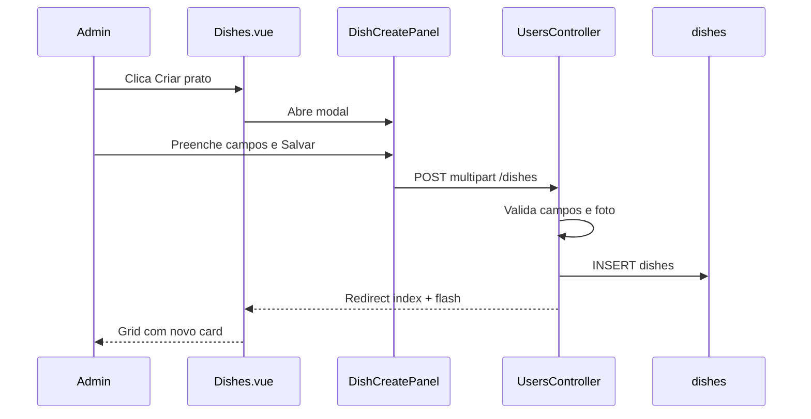

# Fluxo: Criar prato (Admin > Cadastros > Pratos)

> **Tipo:** spec de implementação para IA  
> **Escopo:** cadastrar novo prato via modal (formulário completo).  
> **Pré-requisito:** listagem documentada em `docs/features/cadastroPratos.md` (fase 1 — chips de menu + grid de cards).  
> **Depende de:** `docs/features/cadastroPratos.md`, `docs/features/cadastros.md`, `docs/database/schema.md`  
> **Rota a criar:** `POST /admin/cadastros/dishes` → `UsersController@storeDish`  
> **URL da listagem:** `http://127.0.0.1:8000/admin/cadastros/dishes`

---

## Objetivo

Permitir que o admin **cadastre um novo prato** a partir do botão **Criar prato** na tela de cardápio. A interface reutiliza o **mesmo shell de modal** do cadastro de usuário (`UserCreatePanel` / classes `admin-modal`), com os campos abaixo.

| Campo na UI | Campo persistido | Obrigatório | Editável |
|-------------|------------------|-------------|----------|
| Nome do prato | `dishes.name` | Sim | Sim |
| Descrição | `dishes.description` | Não | Sim |
| Preço | `dishes.price` | Sim | Sim |
| Foto | `dishes.photo_path` | Não | Sim (upload) |
| Categoria | `dishes.category_id` → `dish_categories` | Sim | Sim |
| Prato ativo (checkbox) | `dishes.active` | Sim (default `true`) | Sim |

A **categoria** define em qual **menu** o prato aparece na faixa de chips (ex.: categoria **Bebidas** → chip **Bebidas** e filtro correspondente) e qual **classificação** (pill laranja) é exibida no card.

Após salvar, a listagem recarrega com o novo card no grid e as contagens de `Menu (N itens)` e dos chips são atualizadas.

---

## Gatilho

1. Admin acessa `/admin/cadastros/dishes`.
2. Clica no botão **Criar prato** no canto superior direito da topbar (ao lado de **Criar menu**).
3. Abre o painel `DishCreatePanel` (modal `admin-modal-overlay` + `admin-modal`).

Na fase 1 da listagem o botão está `disabled`. **Habilitar** e ligar a este fluxo.

### Estado em `Dishes.vue`

Espelhar o padrão de `Users.vue` + `UserCreatePanel`:

```js
const isCreatePanelOpen = ref(false);

function openCreatePanel() {
    isCreatePanelOpen.value = true;
}

function closeCreatePanel() {
    isCreatePanelOpen.value = false;
}
```

Template:

```vue
<button
    type="button"
    class="btn-primary"
    title="Cadastrar novo prato"
    @click="openCreatePanel"
>
    Criar prato
</button>

<DishCreatePanel
    v-if="isCreatePanelOpen"
    :categories="props.categories"
    :initial-category-id="selectedCategoryId"
    @close="closeCreatePanel"
/>
```

> `initial-category-id`: se o admin estava com um chip de menu selecionado (ex.: Bebidas), pré-preencher `category_id` no formulário. Se **Todos** estiver selecionado (`selectedCategoryId === null`), deixar categoria vazia para o admin escolher.

---

## UI — painel de cadastro (mesmo shell do cadastro de usuário)

### Reutilização visual obrigatória

Espelhar `UserCreatePanel.vue` + `resources/js/Components/styles/AdminModal.css` (importado globalmente em `resources/js/app.js`):

- Overlay `admin-modal-overlay` — clique fora fecha e descarta
- `section.admin-modal` centralizado — `role="dialog"`, `aria-modal="true"`
- `header.admin-modal-head` com título
- `form.admin-modal-form` com campos em `admin-modal-field`
- Floating labels via `admin-modal-floating-label` + `admin-modal-input-wrap`
- `footer.admin-modal-actions` com **Sair** (`secondary`) e **Salvar** (`primary`)
- Tecla `Esc` fecha (mesmo padrão `onMounted` / `onUnmounted` do create)
- **Não** embutir CSS do modal no `.vue` — usar `AdminModal.css` + CSS específico mínimo em `DishCreatePanel.css` (textarea, preview de foto, checkbox)

### Conteúdo do painel

| Elemento | Valor |
|----------|--------|
| Título | `Cadastrar prato` |
| Botão Sair | Fecha modal, reseta form, limpa preview de foto e erros |
| Botão Salvar | Envia `POST` (desabilitado se `form.processing`) |

### Campos do formulário (ordem sugerida)

#### 1. Nome do prato

| Requisito | Detalhe |
|-----------|---------|
| Controle | `<input type="text">` |
| Label | Floating label `Nome do prato` |
| Validação HTML | `required` |
| Autocomplete | `off` |

```vue
<label class="admin-modal-field">
    <div class="admin-modal-input-wrap">
        <span class="admin-modal-floating-label">Nome do prato</span>
        <input
            v-model="form.name"
            type="text"
            autocomplete="off"
            placeholder=" "
            required
        >
    </div>
    <small v-if="form.errors.name">{{ form.errors.name }}</small>
</label>
```

#### 2. Descrição

| Requisito | Detalhe |
|-----------|---------|
| Controle | `<textarea rows="3">` |
| Label | Floating label `Descricao` |
| Obrigatório | Não |

Usar `admin-modal-input-wrap` com classe adicional `admin-modal-textarea` (estilo em `DishCreatePanel.css`: `min-height`, `resize: vertical`).

#### 3. Preço

| Requisito | Detalhe |
|-----------|---------|
| Controle | `<input type="text" inputmode="decimal">` |
| Label | Floating label `Preco` |
| Placeholder | `0,00` |
| Formato exibido | BRL — usuário pode digitar `12,50` ou `12.50` |
| Backend | `decimal(8, 2)` — normalizar vírgula para ponto antes de validar |

Helper sugerido em `resources/js/utils/parsePrice.js`:

```js
export function parsePriceBRL(value) {
    const normalized = String(value ?? '')
        .trim()
        .replace(/\./g, '')
        .replace(',', '.');

    const amount = Number(normalized);
    return Number.isFinite(amount) ? amount : NaN;
}
```

No submit, enviar `price` já como número ou string com ponto decimal aceita pelo Laravel `numeric`.

#### 4. Foto

| Requisito | Detalhe |
|-----------|---------|
| Controle | `<input type="file" accept="image/jpeg,image/png,image/webp">` |
| Label | `Foto` (floating ou label estático acima do input file) |
| Obrigatório | Não |
| Preview | Thumbnail opcional após seleção (`URL.createObjectURL`) |
| Limpeza | Ao fechar modal, revogar object URL |

```vue
<label class="admin-modal-field admin-modal-photo-field">
    <span class="admin-modal-floating-label">Foto</span>
    <input
        type="file"
        accept="image/jpeg,image/png,image/webp"
        @change="onPhotoChange"
    >
    
    <small v-if="form.errors.photo">{{ form.errors.photo }}</small>
</label>
```

Persistência: `Storage::disk('public')->put('dishes', $file)` → salvar caminho relativo em `dishes.photo_path` (ex.: `dishes/abc.jpg`).

> Garantir `php artisan storage:link` no ambiente de desenvolvimento.

#### 5. Categoria (menu)

Select no estilo `DepartmentSelect.vue`, **sem** swatch de cor — apenas nome da categoria.

| Requisito | Detalhe |
|-----------|---------|
| Componente | `DishCategorySelect.vue` |
| Label | Floating label `Categoria` |
| Opções | `props.categories` — `{ id, name, slug }` |
| Valor | `form.category_id` (UUID string) |
| Comportamento | Dropdown single-select; exibir `category.name` (ex.: Bebidas, Burger) |
| Vazio | Mensagem `Nenhuma categoria disponivel.` |

A categoria escolhida determina:

- Em qual **chip de menu** o prato aparece ao filtrar na listagem.
- O texto da **pill de classificação** no card (`category_name`).

```vue
<div class="admin-modal-field">
    <DishCategorySelect
        :model-value="form.category_id"
        :categories="props.categories"
        :error="form.errors.category_id"
        label="Categoria"
        @update:model-value="(value) => { form.category_id = value; }"
    />
</div>
```

**Pré-seleção:** se `Dishes.vue` passar `initial-category-id` (menu filtrado), inicializar `form.category_id` com esse valor ao abrir o painel.

#### 6. Prato ativo (checkbox)

| Requisito | Detalhe |
|-----------|---------|
| Controle | `<input type="checkbox">` |
| Label visível | `Prato ativo` |
| Default | Marcado (`active: true`) |
| Persistência | `dishes.active` boolean |

```vue
<label class="admin-modal-field admin-modal-checkbox-field">
    <input
        v-model="form.active"
        type="checkbox"
    >
    <span>Prato ativo</span>
</label>
```

**Comportamento do checkbox (importante):**

- Quando **marcado**: `active = true` — prato salvo como ativo.
- Quando **desmarcado**: `active = false` — prato salvo como inativo; na listagem admin pode exibir badge **Inativo** no card (já previsto em `cadastroPratos.md`).
- O **tablet / cardápio do cliente ainda não filtra** por `active` nesta fase — o valor é persistido para uso futuro no módulo de pedidos. Documentar isso na UI com texto auxiliar opcional abaixo do checkbox: `Inativos nao aparecem no tablet (em breve).`

---

## Referência visual (wireframe ASCII)

Mesmo container do cadastro de usuário, com os campos de prato:

```
┌──────────────────────────────────────────┐
│ Cadastrar prato                          │
├──────────────────────────────────────────┤
│ Nome do prato                            │
│ [____________________________________]   │
│                                          │
│ Descricao                                │
│ [____________________________________]   │
│ [____________________________________]   │
│                                          │
│ Preco                                    │
│ [ 0,00_______________________________]   │
│                                          │
│ Foto                                     │
│ [ Escolher arquivo ]  [ preview img ]    │
│                                          │
│ Categoria                                │
│ [ Bebidas                          v ]   │
│                                          │
│ [x] Prato ativo                          │
│     Inativos nao aparecem no tablet      │
│     (em breve)                           │
├──────────────────────────────────────────┤
│                    [ Sair ] [ Salvar ]   │
└──────────────────────────────────────────┘
```

Comparar com cadastro de usuário (referência de shell):

```
┌─────────────────────────────────────┐
│ Cadastrar usuario                   │
├─────────────────────────────────────┤
│ Nome / Departamento / E-mail / Senha│
└─────────────────────────────────────┘
```

---

## Regras de negócio

### Acesso

- Apenas usuário com `role:admin` (`firebase.auth`, middleware `role:admin`).

### Categoria obrigatória

- Todo prato deve ter `category_id` válido existente em `dish_categories`.
- Se não houver categorias cadastradas, desabilitar **Salvar** e exibir aviso no select (`Nenhuma categoria disponivel.`).

### Preço

- Mínimo `0.01` (um centavo).
- Máximo sugerido na validação: `999999.99` (limite do `decimal(8,2)`).

### Foto

- Opcional no cadastro.
- Tipos aceitos: JPEG, PNG, WebP.
- Tamanho máximo: **2 MB** (`max:2048` em KB no Laravel).

### Ativo

- Default `true` ao abrir o modal.
- Persistir no banco; efeito no tablet = **futuro** (fora deste fluxo).

### ID do prato

- UUID gerado no backend: `Str::uuid()->toString()`.

---

## Componentização sugerida

| Arquivo | Papel |
|---------|--------|
| `DishCreatePanel.vue` | Formulário completo no shell `admin-modal` |
| `resources/js/Components/styles/DishCreatePanel.css` | Textarea, preview foto, checkbox |
| `DishCategorySelect.vue` | Select de categoria/menu (espelho simplificado de `DepartmentSelect`) |
| `resources/js/Components/styles/DishCategorySelect.css` | Estilos do dropdown (pode reutilizar padrão `dept-select` sem cor) |
| `resources/js/utils/parsePrice.js` | `parsePriceBRL` |
| `Dishes.vue` | Habilitar botão, estado `isCreatePanelOpen`, passar `categories` e `initial-category-id` |

---

## Comportamento do formulário

```js
import { useForm } from '@inertiajs/vue3';
import { onMounted, onUnmounted, ref, watch } from 'vue';
import { parsePriceBRL } from '../utils/parsePrice';

const props = defineProps({
    categories: { type: Array, default: () => [] },
    initialCategoryId: { type: String, default: null },
});

const emit = defineEmits(['close']);

const photoPreviewUrl = ref(null);

const form = useForm({
    name: '',
    description: '',
    price: '',
    category_id: props.initialCategoryId ?? '',
    active: true,
    photo: null,
});

watch(
    () => props.initialCategoryId,
    (value) => {
        if (value) {
            form.category_id = value;
        }
    },
    { immediate: true }
);

function onPhotoChange(event) {
    const file = event.target.files?.[0] ?? null;
    form.photo = file;

    if (photoPreviewUrl.value) {
        URL.revokeObjectURL(photoPreviewUrl.value);
    }

    photoPreviewUrl.value = file ? URL.createObjectURL(file) : null;
}

function handleCancel() {
    if (photoPreviewUrl.value) {
        URL.revokeObjectURL(photoPreviewUrl.value);
    }
    photoPreviewUrl.value = null;
    form.reset();
    form.clearErrors();
    emit('close');
}

function handleSubmit() {
    const parsedPrice = parsePriceBRL(form.price);

    form.transform((data) => ({
        ...data,
        price: parsedPrice,
        active: data.active ? '1' : '0',
    })).post('/admin/cadastros/dishes', {
        forceFormData: true,
        preserveScroll: true,
        onSuccess: () => handleCancel(),
    });
}
```

- Usar `forceFormData: true` quando houver arquivo (`photo`).
- `active` como `'1'`/`'0'` ou boolean conforme validação Laravel (`boolean` rule aceita ambos).

---

## Integração backend

### Rota

```php
// routes/web.php — dentro do grupo admin/cadastros
Route::post('/dishes', [UsersController::class, 'storeDish'])->name('dishes.store');
```

### Request

```
POST /admin/cadastros/dishes
Content-Type: multipart/form-data (Inertia + foto)

name: Chicken Deluxe Burger
description: Hamburguer com queijo
price: 12.50
category_id: {uuid}
active: 1
photo: (binary, opcional)
```

### Validação (`UsersController@storeDish`)

```php
$validated = $request->validate([
    'name' => ['required', 'string', 'max:255'],
    'description' => ['nullable', 'string', 'max:5000'],
    'price' => ['required', 'numeric', 'min:0.01', 'max:999999.99'],
    'category_id' => ['required', 'uuid', 'exists:dish_categories,id'],
    'active' => ['boolean'],
    'photo' => ['nullable', 'image', 'mimes:jpeg,jpg,png,webp', 'max:2048'],
]);
```

Mensagens customizadas (opcional, `lang/pt`):

| Regra | Mensagem |
|-------|----------|
| `name.required` | Informe o nome do prato. |
| `price.required` | Informe um preço válido. |
| `price.min` | O preço deve ser maior que zero. |
| `category_id.required` | Selecione uma categoria. |
| `photo.image` | A foto deve ser JPG, PNG ou WebP (máx. 2 MB). |

### Persistência

```php
use Illuminate\Support\Str;
use Illuminate\Support\Facades\DB;
use Illuminate\Support\Facades\Storage;

public function storeDish(Request $request): RedirectResponse
{
    $validated = $request->validate([/* ... */]);

    $photoPath = null;
    if ($request->hasFile('photo')) {
        $photoPath = $request->file('photo')->store('dishes', 'public');
    }

    DB::table('dishes')->insert([
        'id' => Str::uuid()->toString(),
        'name' => $validated['name'],
        'description' => $validated['description'] ?? null,
        'price' => $validated['price'],
        'photo_path' => $photoPath,
        'category_id' => $validated['category_id'],
        'active' => $request->boolean('active'),
        'created_at' => now(),
        'updated_at' => now(),
    ]);

    return redirect()
        ->route('admin.cadastros.dishes.index')
        ->with('success', 'Prato cadastrado com sucesso.');
}
```

### Response

Redirect para `dishes.index` + flash `success`. A listagem Inertia recarrega `categories` e `dishes`; o novo prato aparece no grid e nas contagens dos chips.

---

## Integração frontend (Inertia)

### `Dishes.vue` — alterações

1. Remover `disabled` e `aria-disabled` do botão **Criar prato**.
2. Adicionar `isCreatePanelOpen`, handlers `openCreatePanel` / `closeCreatePanel`.
3. Renderizar `DishCreatePanel` condicionalmente.
4. Exibir flash de sucesso (espelhar `Users.vue`):

```js
import { usePage } from '@inertiajs/vue3';

const page = usePage();
const flashSuccess = computed(() => page.props.flash?.success ?? '');
```

```vue
<p v-if="flashSuccess" class="feedback success">{{ flashSuccess }}</p>
```

### `DishCreatePanel.vue` — submit

```js
form.post('/admin/cadastros/dishes', {
    forceFormData: true,
    preserveScroll: true,
    onSuccess: () => emit('close'),
});
```

### `DishCategorySelect.vue` — estrutura mínima

Espelhar `DepartmentSelect.vue` removendo:

- `buildOrderedDepartments` / cores
- Swatch e checkbox visual de departamento

Manter:

- `dept-select` ou renomear para `category-select` (classes em CSS dedicado)
- `role="combobox"`, `listbox`, floating label
- Props: `modelValue`, `categories`, `label`, `error`
- Emit: `update:modelValue`
- Opções ordenadas por `name` ASC

```js
const options = computed(() =>
    [...props.categories].sort((a, b) =>
        String(a.name ?? '').localeCompare(String(b.name ?? ''), 'pt-BR')
    )
);
```

---

## Efeito na listagem após salvar

| Elemento | Comportamento esperado |
|----------|------------------------|
| Grid | Novo `DishCard` visível (em **Todos** e no chip da categoria escolhida) |
| Título | `Menu (N itens)` incrementa `N` |
| Chip da categoria | `dishes_count` atualizado (contagem de ativos no backend) |
| Card | Nome, preço `R$ …`, pill com `category_name`, foto se enviada |
| Prato inativo | Badge **Inativo** no card se checkbox desmarcado |

---

## Fluxo resumido (sequência)



---

## Arquivos a criar / alterar

| Arquivo | Ação |
|---------|------|
| `routes/web.php` | **Alterar** — `POST dishes` |
| `app/Http/Controllers/Admin/UsersController.php` | **Alterar** — `storeDish` |
| `resources/js/Components/DishCreatePanel.vue` | **Criar** |
| `resources/js/Components/styles/DishCreatePanel.css` | **Criar** |
| `resources/js/Components/DishCategorySelect.vue` | **Criar** |
| `resources/js/Components/styles/DishCategorySelect.css` | **Criar** |
| `resources/js/utils/parsePrice.js` | **Criar** |
| `resources/js/Pages/Admin/Cadastros/Dishes.vue` | **Alterar** — botão, painel, flash |
| `docs/features/cadastroPratos.md` | **Atualizar** — link fase 3, checklist |
| `docs/database/schema.md` | Sem alteração de schema (tabelas já existem) |

---

## Acessibilidade e UX

- `role="dialog"`, `aria-modal="true"`, `aria-labelledby` no título do painel.
- Campos obrigatórios com `required` no HTML onde aplicável.
- Erros de validação em `<small>` abaixo de cada campo.
- Botão Salvar: texto `Salvando...` e `:disabled="form.processing"`.
- Flash de sucesso na listagem após redirect.
- Preview de foto com `alt` descritivo.
- File input: label associada; aceitar apenas imagens.

---

## Casos de erro

| Erro | Comportamento esperado |
|------|------------------------|
| 422 validação (nome, preço, categoria) | Modal permanece aberto; `form.errors.*` |
| 422 foto inválida | `form.errors.photo` |
| Categoria inexistente | 422 `category_id` |
| Sem categorias no sistema | Select vazio; orientar criar menu (fase 2) |

---

## O que NÃO fazer nesta entrega

- Editar ou excluir prato existente (`editarPrato.md`).
- Criar categoria/menu neste fluxo (`criarMenu.md`).
- Crop, redimensionar ou otimizar imagem no servidor.
- Múltiplas fotos por prato.
- Filtrar tablet por `active` (apenas persistir o valor).
- Busca textual na listagem.
- Usar modal diferente do padrão `admin-modal` do cadastro de usuário.
- Embutir CSS do shell do modal no `.vue` (usar `AdminModal.css`).

---

## O que NÃO está neste fluxo (resumo)

- CRUD de menu (`criarMenu.md`)
- Edição/exclusão de prato
- Toggle `active` inline no card (sem abrir modal de edição)
- Integração tablet filtrando `active = true`

---

## Critérios de aceite (checklist para IA)

- [ ] Botão **Criar prato** habilitado na topbar de `/admin/cadastros/dishes`.
- [ ] Clicar abre modal com o mesmo visual do cadastro de usuário (`admin-modal-overlay` + `admin-modal`).
- [ ] Modal exibe: Nome, Descrição, Preço, Foto, Categoria, checkbox **Prato ativo**.
- [ ] Categoria lista registros de `dish_categories` (ex.: Bebidas, Pratos Principais).
- [ ] Categoria selecionada define menu/chip e pill de classificação após salvar.
- [ ] Se um chip de menu estava selecionado na listagem, categoria vem pré-preenchida ao abrir o modal.
- [ ] Preço salvo em BRL; exibição no card como `R$ 12,50`.
- [ ] Foto opcional; upload persiste em `dishes.photo_path` e aparece no card.
- [ ] Checkbox **Prato ativo** marcado por padrão; desmarcado salva `active = false` com badge **Inativo** no admin.
- [ ] Tablet **não** altera comportamento ao desmarcar ativo (apenas persistência).
- [ ] **Sair** / overlay / `Esc` fecham sem salvar e limpam preview de foto.
- [ ] **Salvar** chama `POST /admin/cadastros/dishes` com `forceFormData` quando há foto.
- [ ] Sucesso: redirect, flash, novo card no grid, contagem `Menu (N itens)` atualizada.
- [ ] Apenas `admin` acessa rota e painel.
- [ ] CSS específico em arquivos externos (`DishCreatePanel.css`, `DishCategorySelect.css`).

---

## Próximo passo (ordem de implementação)

1. Rota `POST` + `UsersController@storeDish`
2. `parsePrice.js` + validação de preço
3. `DishCategorySelect.vue` + CSS
4. `DishCreatePanel.vue` + CSS (todos os campos)
5. Integrar em `Dishes.vue` (botão, estado, flash, pré-seleção de categoria)
6. Teste manual: criar prato com e sem foto, ativo/inativo, verificar chip e card
7. Atualizar checklist em `docs/features/cadastroPratos.md`

---

## Referência cruzada

- Listagem (fase 1): `docs/features/cadastroPratos.md`
- Modal de referência: `resources/js/Components/UserCreatePanel.vue`
- Select de referência: `resources/js/Components/DepartmentSelect.vue`
- Estilos compartilhados: `resources/js/Components/styles/AdminModal.css`
- Schema: `docs/database/schema.md` — tabelas `dishes`, `dish_categories`
- Fase 2 (menus): `docs/flow/dishes/criarMenu.md` (a criar)
- Fase 4 (edição): `docs/flow/dishes/editarPrato.md` (a criar)
