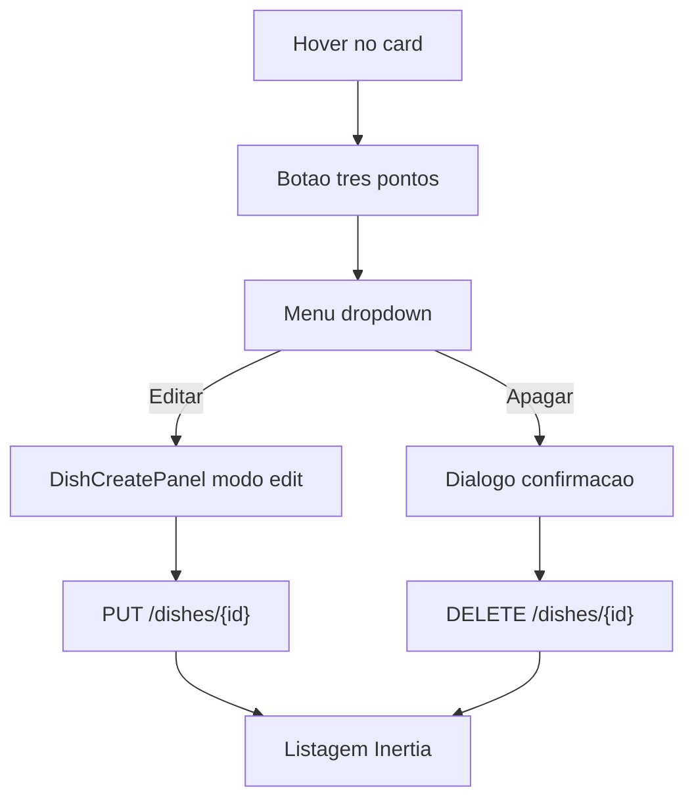
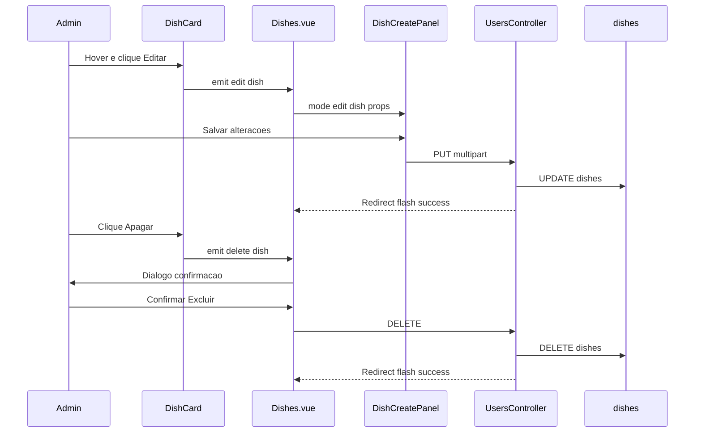

# Fluxo: Editar e excluir prato (Admin > Cadastros > Pratos)

> **Tipo:** spec de implementação para IA  
> **Escopo:** menu de ações no card (três pontinhos) + edição via modal reutilizado + exclusão com confirmação.  
> **Pré-requisito:** listagem (`cadastroPratos.md`) e criar prato (`criarPrato.md`) implementados.  
> **Depende de:** `docs/features/cadastroPratos.md`, `docs/flow/dishes/criarPrato.md`, `docs/features/cadastros.md`, `docs/database/schema.md`  
> **Rotas a criar:** `PUT /admin/cadastros/dishes/{dish}`, `DELETE /admin/cadastros/dishes/{dish}`  
> **URL da listagem:** `http://127.0.0.1:8000/admin/cadastros/dishes`

---

## Objetivo

Permitir que o admin **edite** ou **exclua** pratos diretamente a partir do card na grade do cardápio, sem navegar para outra tela.

| Ação | Comportamento |
|------|----------------|
| **Editar** | Abre o **mesmo modal** usado em **Criar prato** (`DishCreatePanel`), pré-preenchido com os dados do prato; salvar envia `PUT` e atualiza o card. |
| **Apagar** | Abre diálogo de confirmação; confirmar envia `DELETE`, remove o registro do banco e o card **some** do menu/grid. |

A gestão começa no **hover** do card: ícone de **três pontinhos** no canto superior direito → menu com as duas opções.

### Regra técnica de CSS (obrigatória)

- CSS não deve ficar embutido dentro de `.vue`.
- Estilos do menu no card em `DishCard.css` ou `DishCardActionsMenu.css`.
- Diálogo de exclusão: reutilizar classes de `Users.css` (`confirm-delete-overlay`) ou extrair CSS compartilhado.
- Modal de edição: `AdminModal.css` + `DishCreatePanel.css` (mesmo padrão de `criarPrato.md`).

---

## Gatilho — menu no card

### Interação visual

1. Admin passa o mouse sobre um **card de prato** na grade.
2. No **canto superior direito** do card (sobre a área da foto ou do card inteiro), aparece o botão **⋮** (três pontinhos verticais).
3. Admin clica no botão → abre um **menu dropdown** com duas opções:
   - **Editar**
   - **Apagar**
4. Ao escolher uma opção, o dropdown fecha e o fluxo correspondente inicia.

### Referência visual (wireframe ASCII)

**Card em hover:**

```
┌─────────────────────────────┐
│ ┌─────────────────────┐ [⋮] │  ← botão visível só no hover (ou com menu aberto)
│ │       foto          │     │
│ └─────────────────────┘     │
│ Nome do prato               │
│ [Bebidas]            R$ 8,00│
└─────────────────────────────┘
```

**Menu aberto (após clicar ⋮):**

```
                    ┌─────────────┐
               [⋮]  │ Editar      │
                    │ Apagar      │  ← texto vermelho
                    └─────────────┘
```

### Requisitos do botão e do menu

| Elemento | Detalhe |
|----------|---------|
| Posição | `position: absolute`; `top: 8px`; `right: 8px` dentro de `.dish-photo-wrap` (ou overlay no `.dish-card`) |
| Visibilidade padrão | `opacity: 0`; `pointer-events: none` |
| Visibilidade em hover | `.dish-card:hover .dish-card-actions` → `opacity: 1`; `pointer-events: auto` |
| Menu aberto | Manter botão e dropdown visíveis enquanto `isMenuOpen === true` (classe `.is-actions-open` no card) |
| Botão ⋮ | `32×32px`, fundo `#fff`, borda `#eceef0`, `border-radius: 8px`, sombra leve; `aria-label="Acoes do prato"` |
| Dropdown | Fundo `#fff`, borda `#eceef0`, `border-radius: 10px`, `min-width: 140px`, sombra; alinhado abaixo/à esquerda do botão |
| Item Editar | Texto `#17181e`; ícone lápis opcional |
| Item Apagar | Texto `#C53030` (danger) |
| Fechar menu | Clique fora, `Esc`, ou após escolher uma opção |

### Acessibilidade

- Botão ⋮: `aria-expanded="true|false"`, `aria-haspopup="menu"`.
- Lista: `role="menu"`; itens: `role="menuitem"`.
- Foco: Enter/Space no botão abre menu; setas ou Tab entre itens (opcional na v1).
- Não depender só de hover em dispositivos touch: em `@media (hover: none)`, exibir o botão ⋮ sempre com opacidade reduzida (ex.: `0.85`).

### Componentização sugerida

| Arquivo | Papel |
|---------|--------|
| `DishCard.vue` | Renderiza card + botão ⋮ + dropdown; emite `edit` e `delete` |
| `DishCard.css` | Posicionamento, hover, estados do menu |
| `DishCardActionsMenu.vue` | (opcional) Menu isolado se `DishCard` ficar grande |

```vue
<!-- DishCard.vue — emissões -->
const emit = defineEmits(['edit', 'delete']);

function onEdit() {
    closeMenu();
    emit('edit', props.dish);
}

function onDelete() {
    closeMenu();
    emit('delete', props.dish);
}
```

---

## Fluxo — Editar

### Passos

1. Admin clica **Editar** no menu do card.
2. `Dishes.vue` recebe o evento e define `editingDish = dish`.
3. Abre `DishCreatePanel` em **modo edição** (mesmo shell `admin-modal` do criar).
4. Admin altera campos e clica **Salvar alterações**.
5. `PUT /admin/cadastros/dishes/{id}` persiste alterações.
6. Redirect para `dishes.index` + flash; grid atualiza o card (nome, preço, categoria, foto, badge inativo).

### Reutilização do modal de criar prato

O componente [`DishCreatePanel.vue`](../../../resources/js/Components/DishCreatePanel.vue) deve suportar **dois modos** via prop (sem duplicar formulário):

| Aspecto | Modo `create` (padrão) | Modo `edit` |
|---------|------------------------|-------------|
| Prop | `initialCategoryId` opcional | `dish` obrigatório (objeto completo) |
| Título do modal | `Cadastrar prato` | `Editar prato` |
| HTTP | `POST /admin/cadastros/dishes` | `PUT /admin/cadastros/dishes/{dish.id}` |
| Campos iniciais | Vazios / defaults | Pré-preenchidos do `dish` |
| Botão submit | `Salvar` | `Salvar alteracoes` |
| Foto | Apenas upload novo | Preview da `photo_url` atual; novo arquivo **substitui** a foto antiga |

**Campos (idênticos a `criarPrato.md`):**

| Campo UI | Coluna | Observação na edição |
|----------|--------|----------------------|
| Nome do prato | `dishes.name` | Pré-preenchido |
| Descrição | `dishes.description` | Pré-preenchido (pode ser vazio) |
| Preço | `dishes.price` | Pré-preenchido em formato BRL no input |
| Foto | `dishes.photo_path` | Exibir imagem atual; upload opcional |
| Categoria | `dishes.category_id` | Pré-selecionada no `DishCategorySelect` |
| Prato ativo | `dishes.active` | Checkbox reflete valor atual |

### Pré-preenchimento do formulário

Ao montar o painel em modo `edit`:

```js
const props = defineProps({
    mode: { type: String, default: 'create' }, // 'create' | 'edit'
    dish: { type: Object, default: null },
    categories: { type: Array, default: () => [] },
    initialCategoryId: { type: String, default: null },
});

// onMounted ou watch imediato quando mode === 'edit' && dish
form.name = props.dish.name ?? '';
form.description = props.dish.description ?? '';
form.category_id = props.dish.category_id ?? '';
form.active = Boolean(props.dish.active);
priceDigits.value = priceToDigitsFromDecimal(props.dish.price);
photoPreviewUrl.value = props.dish.photo_url ?? null; // URL HTTP, não revoke no unmount se for URL externa
existingPhotoPath.value = props.dish.photo_path ?? null; // para backend saber arquivo antigo
```

Helper sugerido para converter `12.50` → dígitos do input BRL (reutilizar lógica de `priceInput.js`).

### Submit em modo edição

```js
function handleSubmit() {
    const parsedPrice = parsePriceDigitsBRL(priceDigits.value);
    // ... validação local de preço ...

    form.price = parsedPrice;
    form.active = form.active ? '1' : '0';

    if (props.mode === 'edit') {
        form.post(`/admin/cadastros/dishes/${props.dish.id}`, {
            forceFormData: true,
            preserveScroll: true,
            _method: 'put',
            onSuccess: () => handleCancel(),
        });
        return;
    }

    form.post('/admin/cadastros/dishes', { /* create */ });
}
```

> Inertia `useForm` com `_method: 'put'` e `forceFormData: true` quando houver nova foto.

### Foto na edição

| Cenário | Comportamento |
|---------|----------------|
| Admin não altera foto | Manter `photo_path` existente no banco |
| Admin envia nova foto | Salvar novo arquivo em `dishes/`; **deletar** arquivo antigo do `Storage::disk('public')` se existir |
| Admin remove foto (opcional v2) | Campo `remove_photo: true` → `photo_path = null` |

Na v1 da spec, basta **manter** ou **substituir**; remoção explícita da foto é opcional.

### Integração em `Dishes.vue`

```js
const editingDish = ref(null);

function handleEditDish(dish) {
    editingDish.value = dish;
}

function closeEditPanel() {
    editingDish.value = null;
}
```

```vue
<DishCard
    v-for="dish in filteredDishes"
    :key="dish.id"
    :dish="dish"
    @edit="handleEditDish"
    @delete="handleDeleteDish"
/>

<DishCreatePanel
    v-if="editingDish"
    mode="edit"
    :dish="editingDish"
    :categories="props.categories"
    @close="closeEditPanel"
/>
```

> Não abrir painel de criar e edição ao mesmo tempo: `editingDish` e `isCreatePanelOpen` são mutuamente exclusivos.

---

## Fluxo — Apagar

### Passos

1. Admin clica **Apagar** no menu do card.
2. Abre **diálogo de confirmação** (mesmo padrão de exclusão de usuário em [`Users.vue`](../../../resources/js/Pages/Admin/Cadastros/Users.vue)).
3. Texto: `Deseja excluir **{nome do prato}**? Esta acao nao pode ser desfeita.`
4. **Cancelar** → fecha diálogo sem alteração.
5. **Excluir** → `DELETE /admin/cadastros/dishes/{id}`.
6. Sucesso: prato removido do banco; card some do grid; contagens `Menu (N itens)` e chips atualizam; flash `Prato excluido com sucesso.`

### Diálogo de confirmação

Reutilizar estrutura visual:

```vue
<div v-if="pendingDeleteDish" class="confirm-delete-overlay" @click.self="cancelDelete">
    <div class="confirm-delete-dialog">
        <h3>Excluir prato</h3>
        <p>
            Deseja excluir <strong>{{ pendingDeleteDish.name }}</strong>?
            Esta acao nao pode ser desfeita.
        </p>
        <footer class="confirm-delete-actions">
            <button type="button" class="secondary" :disabled="isDeleting" @click="cancelDelete">
                Cancelar
            </button>
            <button type="button" class="danger" :disabled="isDeleting" @click="confirmDelete">
                {{ isDeleting ? 'Excluindo...' : 'Excluir' }}
            </button>
        </footer>
    </div>
</div>
```

Estado em `Dishes.vue`:

```js
import { router } from '@inertiajs/vue3';

const pendingDeleteDish = ref(null);
const isDeleting = ref(false);

function handleDeleteDish(dish) {
    pendingDeleteDish.value = dish;
}

function cancelDelete() {
    pendingDeleteDish.value = null;
}

function confirmDelete() {
    if (!pendingDeleteDish.value || isDeleting.value) {
        return;
    }

    isDeleting.value = true;

    router.delete(`/admin/cadastros/dishes/${pendingDeleteDish.value.id}`, {
        preserveScroll: true,
        onFinish: () => {
            isDeleting.value = false;
            pendingDeleteDish.value = null;
        },
    });
}
```

### Regras de exclusão no banco

| Regra | Detalhe |
|-------|---------|
| Tipo | **Hard delete** — `DELETE` em `dishes` (sem `deleted_at`) |
| Efeito na UI | Card desaparece da listagem após redirect Inertia |
| FK `order_items.dish_id` | `restrictOnDelete` — ver tabela abaixo |
| Arquivo de foto | Remover do `Storage::disk('public')` se `photo_path` existir |

**Bloqueio por pedidos vinculados:**

| Situação | Comportamento |
|----------|----------------|
| Prato **sem** linhas em `order_items` | Exclusão permitida |
| Prato **com** itens em pedidos | Bloquear exclusão; mensagem amigável |

Mensagem sugerida (flash ou `errors.delete`):

`Este prato nao pode ser excluido porque ja foi usado em pedidos.`

Implementação sugerida no controller **antes** do delete:

```php
$hasOrders = DB::table('order_items')
    ->where('dish_id', $dish)
    ->exists();

if ($hasOrders) {
    return redirect()
        ->route('admin.cadastros.dishes.index')
        ->withErrors(['delete' => 'Este prato nao pode ser excluido porque ja foi usado em pedidos.']);
}
```

Exibir em `Dishes.vue`:

```js
const deleteError = computed(() => page.props.errors?.delete ?? '');
```

```vue
<p v-if="deleteError" class="feedback error">{{ deleteError }}</p>
```

Não usar soft delete nesta fase.

---

## Regras de negócio

- Apenas `admin` acessa (`firebase.auth`, `role:admin`).
- Editar e apagar só estão disponíveis na **listagem admin** de pratos (não no tablet).
- Exclusão é irreversível após confirmação.
- Alterar **categoria** move o prato para outro chip/menu e atualiza a pill de classificação no card.
- Campo `active` continua sem efeito no tablet nesta fase (igual `criarPrato.md`).
- Um único menu de ações aberto por vez (fechar outros ao abrir novo — opcional, recomendado).

---

## Fluxo de dados





---

## Rotas

| Método | URI | Controller@method | Middleware |
|--------|-----|-------------------|------------|
| PUT | `/admin/cadastros/dishes/{dish}` | `Admin\UsersController@updateDish` | `firebase.auth`, `role:admin` |
| DELETE | `/admin/cadastros/dishes/{dish}` | `Admin\UsersController@destroyDish` | `firebase.auth`, `role:admin` |

```php
// routes/web.php — dentro do grupo admin/cadastros
Route::put('/dishes/{dish}', [UsersController::class, 'updateDish'])->name('dishes.update');
Route::delete('/dishes/{dish}', [UsersController::class, 'destroyDish'])->name('dishes.destroy');
```

---

## Integração backend

### Estender `getDishes()` — incluir `description`

Necessário para pré-preencher o campo no modal de edição:

```php
->get([
    'dishes.id',
    'dishes.name',
    'dishes.description',
    'dishes.price',
    'dishes.photo_path',
    'dishes.category_id',
    'dishes.active',
    'dish_categories.name as category_name',
])
// ...
'description' => $dish->description,
'photo_path' => $dish->photo_path, // útil para substituir arquivo no update
```

### `UsersController@updateDish`

```php
public function updateDish(Request $request, string $dish): RedirectResponse
{
    $existing = DB::table('dishes')->where('id', $dish)->first();

    if ($existing === null) {
        abort(404);
    }

    $validated = $request->validate([
        'name' => ['required', 'string', 'max:255'],
        'description' => ['nullable', 'string', 'max:5000'],
        'price' => ['required', 'numeric', 'min:0.01', 'max:999999.99'],
        'category_id' => ['required', 'uuid', 'exists:dish_categories,id'],
        'active' => ['boolean'],
        'photo' => ['nullable', 'image', 'mimes:jpeg,jpg,png,webp', 'max:2048'],
    ], [
        'name.required' => 'Informe o nome do prato.',
        'price.required' => 'Informe um preço válido.',
        'category_id.required' => 'Selecione uma categoria.',
        'photo.image' => 'A foto deve ser JPG, PNG ou WebP (máx. 2 MB).',
    ]);

    $photoPath = $existing->photo_path;

    if ($request->hasFile('photo')) {
        if ($photoPath) {
            Storage::disk('public')->delete($photoPath);
        }
        $photoPath = $request->file('photo')->store('dishes', 'public');
    }

    DB::table('dishes')
        ->where('id', $dish)
        ->update([
            'name' => $validated['name'],
            'description' => $validated['description'] ?? null,
            'price' => $validated['price'],
            'photo_path' => $photoPath,
            'category_id' => $validated['category_id'],
            'active' => $request->boolean('active'),
            'updated_at' => now(),
        ]);

    return redirect()
        ->route('admin.cadastros.dishes.index')
        ->with('success', 'Prato atualizado com sucesso.');
}
```

### `UsersController@destroyDish`

```php
public function destroyDish(string $dish): RedirectResponse
{
    $existing = DB::table('dishes')->where('id', $dish)->first();

    if ($existing === null) {
        abort(404);
    }

    $hasOrders = DB::table('order_items')
        ->where('dish_id', $dish)
        ->exists();

    if ($hasOrders) {
        return redirect()
            ->route('admin.cadastros.dishes.index')
            ->withErrors([
                'delete' => 'Este prato nao pode ser excluido porque ja foi usado em pedidos.',
            ]);
    }

    if ($existing->photo_path) {
        Storage::disk('public')->delete($existing->photo_path);
    }

    DB::table('dishes')->where('id', $dish)->delete();

    return redirect()
        ->route('admin.cadastros.dishes.index')
        ->with('success', 'Prato excluido com sucesso.');
}
```

---

## Design tokens — menu no card

| Token | Valor |
|-------|-------|
| Botão ⋮ | `32×32px`, fundo `#fff`, borda `1px solid #eceef0`, `border-radius: 8px` |
| Sombra botão | `0 2px 8px rgb(0 0 0 / 8%)` |
| z-index ações | `3` (acima da foto; badge Inativo usa `z-index` menor ou canto oposto) |
| Dropdown | fundo `#fff`, borda `#eceef0`, `border-radius: 10px`, padding `4px 0` |
| Item hover | fundo `#f6f7f9` |
| Item Apagar | cor `#C53030` |
| Transição opacity | `0.15s ease` |

**Conflito com badge Inativo:** o badge hoje está `top: 8px; right: 8px`. Mover badge para `left: 8px` ou posicionar ⋮ com `top: 8px; right: 8px` e badge `top: 8px; left: 8px` para não sobrepor.

---

## Efeito na listagem após cada ação

| Ação | Grid | Título `Menu (N itens)` | Chips | Card |
|------|------|-------------------------|-------|------|
| Editar (mudou nome/preço/foto) | Card atualizado no lugar | Mesma contagem | `dishes_count` pode mudar se `active` alterado | Reflete novos dados |
| Editar (mudou categoria) | Card aparece no filtro da nova categoria | — | Contagens dos dois menus afetados | Pill com novo `category_name` |
| Apagar | Card removido | `N` diminui | `dishes_count` do menu diminui | — |

---

## Casos de erro

| Erro | Comportamento esperado |
|------|------------------------|
| 422 validação no PUT | Modal permanece aberto; `form.errors.*` |
| Prato não encontrado (PUT/DELETE) | 404 |
| Exclusão com pedidos vinculados | Redirect index; `errors.delete` na listagem |
| Falha ao deletar arquivo Storage | Logar erro; ainda assim remover registro (ou abortar — preferir log + delete DB na v1) |

---

## Acessibilidade e UX

- Menu não deve ficar inacessível em touch: botão ⋮ visível sem hover em `(hover: none)`.
- Diálogo de exclusão: foco no botão Cancelar ou trap de foco opcional.
- Durante `isDeleting`, desabilitar botões do diálogo.
- Flash de sucesso/erro na área `.content` de `Dishes.vue`.
- Após editar, fechar modal e limpar `editingDish`.

---

## O que NÃO está neste fluxo

- Duplicar prato
- Arrastar para reordenar cards
- Exclusão em lote (multi-select)
- Histórico / auditoria de alterações
- Editar ou excluir **categoria/menu** (`criarMenu.md`)
- Soft delete de pratos
- Remover foto sem enviar outra (botão “Remover foto”) — opcional v2
- Ações no tablet do cliente

---

## O que NÃO fazer nesta entrega

- Criar um segundo modal de edição diferente do `DishCreatePanel`.
- Duplicar todo o formulário em `DishEditPanel.vue` (preferir prop `mode` + `dish`).
- Excluir sem diálogo de confirmação.
- Ignorar FK `order_items` e retornar erro 500 genérico.
- Embutir CSS do menu ou do modal dentro do `.vue`.

---

## Arquivos a criar / alterar

| Arquivo | Ação |
|---------|------|
| `routes/web.php` | **Alterar** — `PUT` e `DELETE` dishes |
| `app/Http/Controllers/Admin/UsersController.php` | **Alterar** — `updateDish`, `destroyDish`; `getDishes` com `description` |
| `resources/js/Components/DishCard.vue` | **Alterar** — botão ⋮, menu, emits |
| `resources/js/Components/styles/DishCard.css` | **Alterar** — hover, dropdown, posição badge |
| `resources/js/Components/DishCreatePanel.vue` | **Alterar** — props `mode`, `dish`; PUT; pré-preenchimento |
| `resources/js/Pages/Admin/Cadastros/Dishes.vue` | **Alterar** — handlers edit/delete, painel edit, confirm delete |
| `resources/js/Pages/Admin/Cadastros/styles/Dishes.css` | **Alterar** — `confirm-delete-*` se ainda não existir |
| `docs/features/cadastroPratos.md` | **Atualizar** — link para este fluxo na fase 4 |
| `docs/flow/dishes/criarPrato.md` | **Atualizar** — referência cruzada `editarPratos.md` |

---

## Critérios de aceite (checklist para IA)

- [ ] Ao passar o mouse no card, botão **⋮** aparece no canto superior direito.
- [ ] Em dispositivos sem hover, botão ⋮ permanece utilizável.
- [ ] Clicar ⋮ abre menu com **Editar** e **Apagar**.
- [ ] Clicar fora ou `Esc` fecha o menu.
- [ ] **Editar** abre `DishCreatePanel` com título `Editar prato` e campos pré-preenchidos.
- [ ] Modal de edição usa o mesmo shell `admin-modal` do criar prato.
- [ ] **Salvar alterações** envia `PUT /admin/cadastros/dishes/{id}` (multipart se nova foto).
- [ ] Após editar, card reflete nome, preço, categoria, foto e estado ativo.
- [ ] **Apagar** abre diálogo de confirmação (padrão igual exclusão de usuário).
- [ ] Confirmar exclusão chama `DELETE` e remove o card da listagem.
- [ ] Contagem `Menu (N itens)` e `dishes_count` dos chips atualizam após excluir.
- [ ] Prato usado em `order_items` **não** é excluído; mensagem de erro visível na listagem.
- [ ] Arquivo de foto removido do Storage ao excluir prato ou substituir foto.
- [ ] Flash `Prato atualizado com sucesso.` / `Prato excluido com sucesso.`
- [ ] Apenas `admin` acessa rotas PUT e DELETE.
- [ ] CSS do menu e confirmação em arquivos externos (não inline no `.vue`).

---

## Próximo passo (ordem de implementação)

1. Estender `getDishes()` com `description` e `photo_path`
2. Rotas `PUT` / `DELETE` + `updateDish` / `destroyDish`
3. Menu ⋮ em `DishCard.vue` + CSS
4. `DishCreatePanel` — modo `edit` + PUT
5. `Dishes.vue` — wiring edit, delete, confirmação
6. Teste: editar campos, trocar categoria, trocar foto, excluir prato sem pedidos
7. Teste: tentar excluir prato com `order_items` — deve bloquear
8. Atualizar `cadastroPratos.md` e checklist

---

## Referência cruzada

- Listagem: `docs/features/cadastroPratos.md`
- Criar prato: `docs/flow/dishes/criarPrato.md`
- Modal: `resources/js/Components/DishCreatePanel.vue`
- Confirmação delete: `resources/js/Pages/Admin/Cadastros/Users.vue`
- Schema / FK: `docs/database/schema.md` — `dishes`, `order_items`
- Fase menus: `docs/flow/dishes/criarMenu.md` (a criar)
