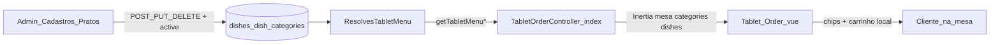

# Fluxo: Lanches vinculados ao tablet

> **Tipo:** spec de implementação para IA (não implementar neste chat — apenas seguir este documento em uma execução dedicada)  
> **Escopo:** vincular o **cardápio real** do admin ao tablet (`/tablet`): todo prato cadastrado, ativo e com menu válido aparece para **visualizar** e **comprar** (carrinho local da Parte 1 do tablet).  
> **Pré-requisito:** Parte 1 do tablet (`docs/features/tablet.md`); criar/editar prato (`docs/flow/dishes/criarPrato.md`, `editarPratos.md`); cadastro admin (`docs/features/cadastroPratos.md`).  
> **Depende de:** `docs/features/tablet.md` § Parte 3, `docs/database/schema.md` (`dishes`, `dish_categories`, `dishes.active`)  
> **Rota:** `GET /tablet?mesa={number}` → `TabletOrderController@index`  
> **URL do tablet:** `http://127.0.0.1:8000/tablet?mesa=1`

---

## Regra de produto (resumo)

| Conceito | Significado | No banco / admin |
|----------|-------------|------------------|
| **Lanche no menu** | O item pertence a uma categoria (menu) do cardápio | `dishes.category_id` → `dish_categories.id` |
| **Lanche disponível** | O item pode ser visto e adicionado ao carrinho no tablet | `dishes.active = true` |
| **Comprar (esta entrega)** | Cliente adiciona ao carrinho + confirma na UI | Carrinho local em `Order.vue` — **sem** `POST /tablet/orders` |

**Frase única:** se o admin **criou o prato**, escolheu um **menu** e deixou **Prato ativo** marcado, esse lanche **deve aparecer** no tablet no chip correto, com foto e preço iguais ao cadastro, para o cliente montar o pedido.

**Não** criar tabela ou modelo `lanches`. O vínculo é `dishes` + `dish_categories` + `dishes.active`.

---

## Objetivo

Substituir o **cardápio mock** da Parte 1 do tablet por dados reais do banco. O cliente na mesa:

1. Abre `/tablet?mesa=N`
2. Vê chips de menu (categorias) e grid de pratos **disponíveis**
3. Filtra por categoria, adiciona itens ao carrinho, edita observação e confirma (fluxo UI já existente — `tablet.md` Parte 1)

O admin continua gerenciando pratos em `/admin/cadastros/dishes`. Alterações refletem no tablet após **reload** (sem tempo real nesta fase).

---

## Glossário

| Termo na spec | No sistema |
|---------------|------------|
| **Menu** | `dish_categories` (ex.: Burgers, Bebidas) |
| **Lanche / item** | `dishes` — sinônimo de prato no cardápio do cliente |
| **Lanche no menu** | Prato com `category_id` válido em `dish_categories` |
| **Lanche disponível** | `dishes.active = true` |
| **Indisponível no tablet** | `active = false` ou prato excluído |

---

## Regras de visibilidade

| Situação no admin | Aparece no tablet? |
|-------------------|-------------------|
| Prato criado, `active = true`, categoria válida | **Sim** |
| Prato criado, `active = false` | **Não** |
| Prato excluído (`DELETE`) | **Não** |
| Categoria sem nenhum prato ativo | Chip do menu **oculto** (`dishes_count = 0`) |
| Nenhum prato ativo no sistema | Estado vazio amigável no grid (sem erro 500) |

### Sincronização admin ↔ tablet

| Ação no admin | Efeito no tablet |
|---------------|------------------|
| Criar prato com **Prato ativo** | Aparece após reload |
| Desmarcar **Prato ativo** | Some após reload |
| Excluir prato | Some após reload |
| Alterar preço, foto, nome, descrição, categoria | Reflete após reload |
| Item já no carrinho quando preço muda | Linha mantém `unitPrice` do momento do add |

---

## Estado atual do repositório (para a IA)

| Item | Status esperado |
|------|-----------------|
| `Order.vue`, `TabletDishCard`, carrinho, chips | **Existe** (Parte 1) |
| `TabletOrderController@index` | Chama `getTabletMenuCategories()` e `getTabletMenuDishes()` |
| `UsersController@dishes` | Chama `getDishCategories()` e `getDishes()` |
| `app/Http/Controllers/Concerns/ResolvesTabletMenu.php` | **Criar** — trait referenciada mas pode estar ausente |
| Mock estático no `TabletOrderController` | **Remover** se ainda existir |
| Estado vazio em `Order.vue` | Pode existir; validar tag HTML (`div`, não `motion`) |
| `DishCreatePanel` — texto do checkbox | Deve ser `Inativos nao aparecem no tablet.` (sem “em breve”) |

---

## Ordem de implementação (IA)

1. **Criar** `ResolvesTabletMenu.php` com os quatro métodos abaixo.
2. **Garantir** `TabletOrderController@index` usa apenas o trait (sem arrays mock).
3. **Garantir** `UsersController` usa o trait para admin (sem métodos privados duplicados).
4. **Validar** props Inertia batem com o contrato de `Order.vue`.
5. **Ajustar** estado vazio e copy do checkbox admin se necessário.
6. **Testar** cenários da seção [Critérios de aceite](#critérios-de-aceite).

---

## Fluxo ponta a ponta



### Gatilho

1. Cliente abre `GET /tablet?mesa=N` (N inteiro 1–99).
2. Backend valida `mesa`; se inválida → `MissingMesa.vue` (inalterado).
3. Backend carrega categorias (só com pratos ativos) e pratos ativos.
4. `Order.vue` renderiza chips + grid; filtro é **client-side** por `category_id`.

---

## Backend

### Arquivo principal

`app/Http/Controllers/Tablet/TabletOrderController.php`

- **Remover** qualquer fixture/mock de `$categories` / `$dishes`.
- **Manter** validação de mesa 1–99.
- **Retornar** props conforme [Contrato Inertia](#contrato-inertia-ordervue).

```php
public function index(Request $request)
{
    $mesa = $request->query('mesa');

    if (!isset($mesa) || !ctype_digit((string) $mesa) || (int) $mesa < 1 || (int) $mesa > 99) {
        return Inertia::render('Tablet/MissingMesa');
    }

    $mesa = (int) $mesa;

    return Inertia::render('Tablet/Order', [
        'mesa' => $mesa,
        'categories' => $this->getTabletMenuCategories(),
        'dishes' => $this->getTabletMenuDishes(),
    ]);
}
```

> **Não** validar se `mesa` existe em `tables` nesta entrega.

---

### Trait `ResolvesTabletMenu`

**Criar:** `app/Http/Controllers/Concerns/ResolvesTabletMenu.php`

Usar `Illuminate\Support\Facades\DB` e `Storage` (mesmo padrão de `cadastroPratos.md`).

| Método | Consumidor | Comportamento |
|--------|------------|---------------|
| `getDishCategories()` | Admin `UsersController@dishes` | **Todas** as categorias; `dishes_count` = só pratos com `active = true` |
| `getDishes()` | Admin | **Todos** os pratos (ativos e inativos); incluir `description` (ver `editarPratos.md`) |
| `getTabletMenuCategories()` | Tablet | Categorias com `dishes_count > 0` (contagem só de ativos) |
| `getTabletMenuDishes()` | Tablet | Só `dishes.active = true` |
| `dishPhotoUrl(?string $photoPath): ?string` | Admin + tablet | `null` se vazio; senão URL pública (`Storage::url`) |

#### `dishPhotoUrl`

```php
protected function dishPhotoUrl(?string $photoPath): ?string
{
    if ($photoPath === null || trim($photoPath) === '') {
        return null;
    }

    return Storage::url(ltrim($photoPath, '/'));
}
```

#### Query — pratos no tablet (`getTabletMenuDishes`)

```sql
SELECT
  dishes.id,
  dishes.name,
  dishes.description,
  dishes.price,
  dishes.photo_path,
  dishes.category_id,
  dish_categories.name AS category_name
FROM dishes
INNER JOIN dish_categories ON dish_categories.id = dishes.category_id
WHERE dishes.active = true
ORDER BY dish_categories.name ASC, dishes.name ASC
```

Mapear cada linha para:

```php
[
    'id' => (string) $row->id,
    'name' => (string) $row->name,
    'description' => $row->description !== null && trim((string) $row->description) !== ''
        ? (string) $row->description
        : null,
    'price' => (float) $row->price,
    'photo_url' => $this->dishPhotoUrl($row->photo_path),
    'category_id' => (string) $row->category_id,
    'category_name' => (string) $row->category_name,
]
```

#### Query — categorias no tablet (`getTabletMenuCategories`)

Contar apenas pratos **ativos**; retornar **somente** categorias com contagem > 0:

```sql
SELECT dish_categories.id, dish_categories.name, dish_categories.slug,
       COUNT(dishes.id) AS dishes_count
FROM dish_categories
LEFT JOIN dishes ON dishes.category_id = dish_categories.id AND dishes.active = true
GROUP BY dish_categories.id, dish_categories.name, dish_categories.slug
HAVING COUNT(dishes.id) > 0
ORDER BY dish_categories.name ASC
```

#### Admin — `getDishCategories` e `getDishes`

Extrair de `UsersController` conforme `docs/features/cadastroPratos.md` (queries existentes na doc). `getDishes()` deve expor pelo menos:

`id`, `name`, `description`, `price`, `photo_url`, `category_id`, `category_name`, `active`

**Remover** do `UsersController` métodos privados duplicados após o trait existir.

---

### Contrato Inertia — `Order.vue`

Shape **obrigatório** (já consumido pelo frontend):

```php
[
    'mesa' => 12,                    // int
    'categories' => [
        [
            'id' => 'uuid',
            'name' => 'Burger',
            'slug' => 'burger',
            'dishes_count' => 3,
        ],
    ],
    'dishes' => [
        [
            'id' => 'uuid',
            'name' => 'Chicken Deluxe Burger',
            'description' => '...',       // null se vazio
            'price' => 32.90,
            'photo_url' => '/storage/...', // null → placeholder no card
            'category_id' => 'uuid',
            'category_name' => 'Burger',
        ],
    ],
]
```

| Campo | Regra |
|-------|--------|
| `photo_url` | Via `dishPhotoUrl()`; `null` aceito |
| `description` | `null` se vazio (não enviar `""` obrigatório) |
| `price` | `float` — exibição com `formatPriceBRL` no Vue |

**Sem mudança obrigatória** no contrato do frontend se o shape acima for respeitado.

---

## Frontend tablet

### Comportamento existente (não reimplementar)

- Chips: "Todos" + `DishCategoryChip` por categoria; filtro client-side.
- `TabletDishCard`: foto ou placeholder, nome, preço, descrição truncada.
- Carrinho local, stepper, observação max 200, confirmar sem POST.

Ver `docs/features/tablet.md` Parte 1.

### Estado vazio (obrigatório)

Quando `dishes.length === 0` após carregar props:

| Elemento | Valor |
|----------|--------|
| Mensagem | `Nenhum item disponível no momento.` |
| Subtexto | `O cardápio será atualizado em breve.` |
| Posição | Dentro de `.order-dish-grid`, centralizado |
| Classe | `.order-dish-empty` em `Order.css` |

```
┌──────────────────────────────────────┐
│  [Todos]                             │  ← count 0
│                                      │
│     Nenhum item disponível           │
│     no momento.                      │
│                                      │
└──────────────────────────────────────┘
```

**Correção:** se existir tag inválida (ex.: `<motion>`), usar `<div class="order-dish-empty">`.

### Carrinho e preço

- Ao **adicionar**, `unitPrice = dish.price` (snapshot).
- Se admin alterar preço e cliente der reload, novos adds usam preço novo; linhas antigas no carrinho mantêm `unitPrice` anterior.

---

## Admin — copy do checkbox

Em `DishCreatePanel.vue`, texto auxiliar abaixo de **Prato ativo**:

- **Correto:** `Inativos nao aparecem no tablet.`
- **Remover:** qualquer variante com `(em breve)`.

Atualizar `criarPrato.md` / `cadastroPratos.md` **somente** se a IA encontrar texto desatualizado lá — foco desta entrega é o vínculo tablet.

---

## Mapeamento visual admin → tablet

```
ADMIN (/admin/cadastros/dishes)          TABLET (/tablet?mesa=1)
┌─────────────────────────┐              ┌─────────────────────────┐
│ [Bebidas] Burger        │              │ [Todos][Bebidas][Burger]│
│ ┌─────┐ ┌─────┐         │   active     │ ┌─────┐ ┌─────┐         │
│ │Ativo│ │Inativo│       │   = true     │ │ R$  │ │ R$  │         │
│ └─────┘ └─────┘         │  ──────────►  │ │ [+] │ │ [+] │         │
│  (some)  (não lista)    │   reload      │ └─────┘ └─────┘         │
└─────────────────────────┘              └─────────────────────────┘
```

---

## Cenários de teste manual

| # | Passos | Resultado esperado |
|---|--------|-------------------|
| 1 | Admin: criar prato ativo em "Bebidas" | Após F5 no tablet, prato no chip Bebidas |
| 2 | Desmarcar **Prato ativo** | Prato some do tablet após reload; ainda visível no admin com badge Inativo |
| 3 | Reativar prato | Volta ao tablet após reload |
| 4 | Excluir prato | Some do tablet e do admin |
| 5 | Último prato ativo de uma categoria desativado | Chip da categoria some |
| 6 | Desativar todos os pratos | Mensagem de estado vazio; sem 500 |
| 7 | `/tablet` sem mesa ou `?mesa=abc` | `MissingMesa.vue` |
| 8 | Adicionar 2× mesmo prato, observação, confirmar | Carrinho e total BRL corretos; confirmar limpa carrinho (sem POST) |
| 9 | Prato com e sem foto | Foto exibida ou placeholder no `TabletDishCard` |

---

## Fora de escopo

- `POST /tablet/orders` e kanban `/admin/orders` (`tablet.md` Parte 2)
- Tabela ou modelo `lanches`
- Laravel Broadcasting / tempo real
- Busca textual no tablet
- Validar `mesa` em `tables`
- QR code, Firebase na rota tablet

---

## Mapa de arquivos

| Arquivo | Ação |
|---------|------|
| `docs/flow/tablets/lanchesVinculados.md` | Este documento |
| `app/Http/Controllers/Concerns/ResolvesTabletMenu.php` | **Criar** |
| `app/Http/Controllers/Tablet/TabletOrderController.php` | **Alterar** — cardápio real, sem mock |
| `app/Http/Controllers/Admin/UsersController.php` | **Alterar** — usar trait; remover duplicatas |
| `resources/js/Pages/Tablet/Order.vue` | **Validar** — estado vazio; corrigir tag HTML se necessário |
| `resources/js/Pages/Tablet/styles/Order.css` | **Validar** — `.order-dish-empty` |
| `resources/js/Components/DishCreatePanel.vue` | **Validar** — copy do checkbox |

**Não alterar** (salvo bug bloqueante): `TabletDishCard`, `TabletCart`, layout split/FAB, `MissingMesa.vue`.

---

## Critérios de aceite

- [ ] Trait `ResolvesTabletMenu` existe e é usada por `TabletOrderController` e `UsersController`
- [ ] `/admin/cadastros/dishes` carrega sem erro (categorias + pratos)
- [ ] Criar prato ativo → após reload aparece em `/tablet?mesa=1` no chip correto
- [ ] Desmarcar **Prato ativo** → prato some do tablet após reload
- [ ] Prato inativo continua no admin com indicação **Inativo**
- [ ] Chips listam apenas menus com ≥ 1 prato ativo
- [ ] Foto e preço no tablet iguais ao admin
- [ ] Sem pratos ativos → estado vazio; sem erro 500
- [ ] `?mesa=abc` ou ausente → `MissingMesa.vue`
- [ ] Carrinho, stepper, total BRL e confirmar funcionam com dados reais
- [ ] Checkbox admin: `Inativos nao aparecem no tablet.` (sem “em breve”)
- [ ] Nenhum fixture/mock permanece no `TabletOrderController`

---

## Referências cruzadas

| Documento | Relação |
|-----------|---------|
| `docs/features/tablet.md` § Parte 3 | Visão de produto do cardápio real |
| `docs/flow/dishes/criarPrato.md` | Criação, `active`, categoria |
| `docs/flow/dishes/editarPratos.md` | Edição, exclusão, `description` no admin |
| `docs/features/cadastroPratos.md` | Queries admin de referência |
| `docs/database/schema.md` | `dishes`, `dish_categories`, índice `active` |
