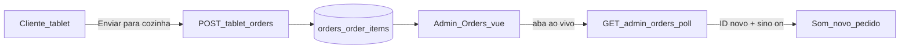

# Fluxo: Pedido do tablet para a cozinha

> **Tipo:** spec de implementação para IA (não implementar neste chat — apenas seguir este documento em uma execução dedicada)  
> **Escopo:** integração completa **tablet → banco → `/admin/orders`** na mesma entrega: persistir pedido ao confirmar, remover fixtures hardcoded do kanban, avançar status no banco, alerta sonoro com botão sino.  
> **Pré-requisito:** Parte 1 do tablet (`docs/features/tablet.md`); cardápio real (`docs/flow/tablets/lanchesVinculados.md`); mesas seedadas (`RestaurantTableSeeder`, mesas 1–10).  
> **Depende de:** `docs/features/tablet.md` § Parte 2, `docs/features/pedidos.md`, `docs/database/schema.md` (`orders`, `order_items`, `tables`, `dishes`)  
> **Rotas:** `POST /tablet/orders` · `GET /admin/orders` · `GET /admin/orders/poll` · `PATCH /admin/orders/{order}/status`  
> **URL tablet:** `http://127.0.0.1:8000/tablet?mesa=1`  
> **URL cozinha/admin:** `http://127.0.0.1:8000/admin/orders`

---

## Regra de produto (resumo)

| Ação | Resultado |
|------|-----------|
| Cliente confirma pedido no tablet | Registro em `orders` + `order_items`; card na coluna **Pendente** de `/admin/orders` |
| Operador clica **Preparar pedido** | `status` → `in_progress`; card move para **Preparando** |
| Operador clica **Finalizar pedido** | `status` → `ready`; card move para **Finalizados** |
| Sino **desativado** | Nenhum som ao chegar pedido novo |
| Sino **ativado** + aba ao vivo aberta | Som de aviso a cada pedido novo (via polling) |

**Frase única:** o tablet deixa de ser simulação local; ao **Enviar para a cozinha**, o pedido passa a existir no sistema e a equipe vê e opera em `/admin/orders`.

---

## Objetivo

1. **Tablet:** `confirmOrder()` chama `POST /tablet/orders` e persiste o pedido.
2. **Admin:** `OrdersController` lê pedidos reais do banco (remover `getOrders()` / `getHistory()` hardcoded).
3. **Status:** `PATCH /admin/orders/{order}/status` persiste mudança de coluna no kanban.
4. **Som:** botão sino na toolbar de pedidos — desativado = silêncio; ativado = aviso sonoro quando surgir novo pedido `pending` (detecção por **polling**, sem WebSocket nesta fase).

---

## Glossário

| Termo | Significado |
|-------|-------------|
| **Pedido** | Linha em `orders` + N linhas em `order_items` |
| **Origem mesa** | `orders.origin = 'table'` |
| **Pendente** | `orders.status = 'pending'` — coluna esquerda do kanban |
| **Ao vivo** | Aba "Pedidos ao vivo" em `Orders.vue` (kanban 3 colunas) |
| **Sino ativado** | Preferência salva no navegador; habilita som em novos pedidos |

---

## Estado atual do repositório (para a IA)

| Item | Status |
|------|--------|
| `Order.vue` — `confirmOrder()` | Limpa carrinho local; toast "Integração na próxima etapa" — **substituir por POST** |
| `POST /tablet/orders` | **Não existe** em `routes/web.php` |
| `TabletOrderController` | Só `index()` |
| `Admin\OrdersController` | `getOrders()` e `getHistory()` com arrays fixos; `updateStatus()` só `redirect()->back()` |
| `Orders.vue` | Kanban + drag; sino com `disabled` |
| Migrations `orders`, `order_items`, `tables` | **Existem** |
| `RestaurantTableSeeder` | Mesas 1–10 |
| Models Eloquent `Order` / `OrderItem` | **Opcional** — `DB::` aceito |

---

## Ordem de implementação (IA)

1. **Backend:** `POST /tablet/orders` + transação `orders` / `order_items`.
2. **Backend:** refatorar `OrdersController@index` / `history` com queries reais; implementar `updateStatus` com persistência.
3. **Backend:** `GET /admin/orders/poll` (IDs pendentes do dia).
4. **Frontend tablet:** `Order.vue` — POST no confirmar, loading, erros, toast de sucesso.
5. **Frontend admin:** `Orders.vue` — sino toggle, polling, som, reload parcial do kanban.
6. **Asset:** `public/sounds/new-order.mp3`.
7. **Testar** cenários da seção [Critérios de aceite](#critérios-de-aceite).

---

## Fluxo ponta a ponta



### Gatilho — tablet

1. Cliente monta carrinho em `/tablet?mesa=N`.
2. Clica **Confirmar pedido** → modal → **Enviar para a cozinha**.
3. Frontend envia `POST /tablet/orders`.
4. Sucesso: carrinho limpo; mensagem *"Pedido enviado para a cozinha"*.

### Gatilho — cozinha/admin

1. Operador abre `/admin/orders` (aba **Pedidos ao vivo**).
2. Novo pedido aparece em **Pendente** (após reload ou poll).
3. Se sino **ativado**, toca som uma vez por pedido novo.
4. Operador avança status pelos botões do card ou drag entre colunas.

---

## Backend — `POST /tablet/orders`

### Rota

| Item | Valor |
|------|-------|
| Método / URI | `POST /tablet/orders` |
| Auth | **Nenhuma** (pública, fora de `firebase.auth`) |
| Controller | `TabletOrderController@store` |
| Resposta sucesso | `201` JSON |

Registrar em `routes/web.php` junto ao `GET /tablet` (fora do grupo autenticado).

### Body JSON

```json
{
  "mesa": 12,
  "items": [
    {
      "dish_id": "550e8400-e29b-41d4-a716-446655440000",
      "quantity": 2,
      "note": "Sem cebola"
    }
  ]
}
```

### Validação

| Campo | Regra | Erro |
|-------|--------|------|
| `mesa` | Obrigatório, inteiro 1–99 | 422 |
| `mesa` | Deve existir em `tables.number` | 422 `"Mesa não encontrada"` |
| `items` | Array não vazio | 422 |
| `items.*.dish_id` | UUID existente em `dishes` | 422 |
| `items.*.dish_id` | `dishes.active = true` | 422 `"Prato indisponível"` |
| `items.*.quantity` | Inteiro ≥ 1 | 422 |
| `items.*.note` | Opcional, string, max 200 | 422 |

### Transação

```php
DB::transaction(function () {
    // 1. Resolver table_id por tables.number = mesa
    // 2. INSERT orders (uuid, table_id, origin='table', status='pending', paid=false)
    // 3. Para cada item: INSERT order_items (unit_price = dishes.price atual)
});
```

| Campo `orders` | Valor |
|----------------|-------|
| `id` | `Str::uuid()` |
| `table_id` | FK resolvida |
| `origin` | `'table'` |
| `status` | `'pending'` |
| `paid` | `false` |

| Campo `order_items` | Valor |
|---------------------|-------|
| `unit_price` | Snapshot de `dishes.price` no momento do pedido |
| `note` | `null` se vazio |

### Resposta

```json
{
  "order_id": "uuid-completo",
  "message": "Pedido enviado para a cozinha"
}
```

**Opcional:** rate limit leve por IP (`throttle:30,1`).

---

## Backend — `Admin\OrdersController`

**Arquivo:** `app/Http/Controllers/Admin/OrdersController.php`

**Remover por completo** os arrays estáticos em `getOrders()` e `getHistory()`.

### Kanban ao vivo — `index` / `history`

Consultar pedidos do **dia atual** (`whereDate('created_at', today())`) agrupados por status:

| Coluna UI | `orders.status` |
|-----------|-----------------|
| Pendente | `pending` |
| Preparando | `in_progress` |
| Finalizados | `ready` |

Pedidos `cancelled` **não** entram no kanban ao vivo — só no histórico.

### Query sugerida (itens do card)

```sql
SELECT
  orders.id,
  orders.status,
  tables.number,
  tables.label,
  order_items.quantity,
  order_items.note,
  dishes.name AS dish_name
FROM orders
INNER JOIN tables ON tables.id = orders.table_id
INNER JOIN order_items ON order_items.order_id = orders.id
INNER JOIN dishes ON dishes.id = order_items.dish_id
WHERE orders.origin = 'table'
  AND DATE(orders.created_at) = CURRENT_DATE
ORDER BY orders.created_at ASC
```

Agrupar em PHP por `orders.id` para montar o array por coluna.

### Shape Inertia — contrato com `OrderCard.vue`

Manter estrutura já consumida pelo Vue:

```php
[
    'id' => 'a1b2',                    // display curto — ver abaixo
    'mesa' => 'Mesa 12',               // tables.label ?? "Mesa {number}"
    'items' => [
        ['qty' => 2, 'name' => 'Burger', 'note' => 'Sem cebola'],
        ['qty' => 1, 'name' => 'Coca-cola', 'note' => null],
    ],
    'note_summary' => '- Sem cebola',  // null se todas notes vazias
]
```

#### `id` exibido no card

Função única `formatOrderDisplayId(string $uuid): string`:

- Remover hífens do UUID; usar **primeiros 4 caracteres** em minúsculo.
- Ex.: `550e8400-e29b-41d4-a716-446655440000` → `550e`
- `OrderCard` renderiza `#{{ order.id }}` → usuário vê `#550e`

Guardar UUID completo internamente para `PATCH` (ver abaixo).

**Opção recomendada:** enviar ao frontend:

```php
[
    'id' => '550e',           // display
    'uuid' => '550e8400-...', // para PATCH
    // ...
]
```

Ajustar `Orders.vue` / `persistStatus` para usar `order.uuid` no PATCH se `id` for só display. Se preferir um único campo, usar UUID completo em `id` e formatar só no template — documentar uma abordagem e manter consistente.

#### `note_summary`

- Coletar `order_items.note` não vazias.
- Prefixar cada uma com `- ` (hífen + espaço).
- Unir com `, ` (vírgula + espaço).
- Se nenhuma note: `null`.

### Histórico — `getHistory(date_from, date_to)`

Pedidos com `status IN ('ready', 'cancelled')` e `DATE(updated_at)` no intervalo.

| Coluna tabela | Fonte |
|---------------|--------|
| Pedido | `#` + display id |
| Mesa | `tables.label` ?? `Mesa {number}` |
| Itens | nomes dos pratos separados por vírgula |
| Status | `ready` → badge "Pronto"; `cancelled` → "Cancelado" |
| Horário | `updated_at` formatado `H:i` |

### `updateStatus`

| Item | Valor |
|------|-------|
| Rota | `PATCH /admin/orders/{order}/status` |
| Body | `{ "status": "in_progress" }` |
| Valores aceitos | `pending`, `in_progress`, `ready`, `cancelled` |

```php
// Validar transição ou aceitar qualquer status válido na v1
DB::table('orders')->where('id', $orderUuid)->update([
    'status' => $validated['status'],
    'updated_at' => now(),
]);
return redirect()->back();
```

`{order}` na rota = **UUID completo** do pedido.

---

## Backend — `GET /admin/orders/poll`

Endpoint leve para detecção de novos pedidos **sem** WebSocket.

| Item | Valor |
|------|-------|
| Método / URI | `GET /admin/orders/poll` |
| Middleware | `firebase.auth`, `role:admin` |
| Controller | `OrdersController@poll` |

### Resposta

```json
{
  "pending_ids": [
    "550e8400-e29b-41d4-a716-446655440000",
    "6ba7b810-9dad-11d1-80b4-00c04fd430c8"
  ],
  "server_time": "2026-05-18T14:32:00-03:00"
}
```

### Query

IDs de pedidos com:

- `status = 'pending'`
- `whereDate('created_at', today())`
- Ordenar por `created_at ASC`

Sem payload de itens — só IDs para diff no frontend.

---

## Frontend tablet — `Order.vue`

### Alterar `confirmOrder()`

**Antes:** limpa carrinho e toast local.

**Depois:**

1. Validar `cart.length > 0`.
2. `isSubmitting = true`; desabilitar botão **Enviar para cozinha**.
3. `POST /tablet/orders` com:

```js
{
  mesa: props.mesa,
  items: cart.value.map((line) => ({
    dish_id: line.dishId,
    quantity: line.quantity,
    note: line.note?.trim() || null,
  })),
}
```

Usar `axios` (CSRF via meta Laravel) ou `router.post` se preferir Inertia — JSON + resposta JSON é suficiente.

4. **Sucesso (201):** limpar carrinho; fechar modais; toast `Pedido enviado para a cozinha` (remover texto "localmente / próxima etapa").
5. **Erro 422:** exibir `errors` ou `message` no modal (mesa, prato indisponível).
6. **Erro rede:** manter carrinho; permitir tentar de novo.
7. `finally`: `isSubmitting = false`.

### Loading no modal

- Botão **Enviar para cozinha**: `disabled` + texto "Enviando..." durante request.

---

## Frontend admin — `Orders.vue`

### Dados reais

- Inicializar `localOrders` a partir de `props.orders`.
- `watch(() => props.orders, ...)` para sincronizar após `router.reload` ou PATCH.
- Manter filtro de busca client-side por `item.name` (inalterado).

### Botão sino

**Remover** `disabled` do botão em `.bell-btn`.

| Estado | Visual | Comportamento |
|--------|--------|---------------|
| **Desativado** (default) | `.bell-btn--off` — opacidade 0.5 | Sem som |
| **Ativado** | `.bell-btn--on` — opacidade 1, borda destacada | Som em pedidos novos |

**Persistência:** `localStorage` chave `4food_orders_sound` — valores `'0'` | `'1'`.

**Toggle:** clique alterna estado; atualizar `aria-pressed`, `aria-label` e `title`:

- Desativado: `aria-label="Ativar notificações sonoras"`, `title="Notificações desativadas"`
- Ativado: `aria-label="Desativar notificações sonoras"`, `title="Notificações ativadas"`

**Unlock de áudio:** na primeira ativação do sino, chamar `audio.play()` silencioso ou com volume 0 para satisfazer política do navegador (interação do usuário).

### Polling

| Condição | Ação |
|----------|------|
| `activeTab === 'live'` e `document.visibilityState === 'visible'` | Iniciar intervalo |
| Caso contrário | Parar intervalo (`clearInterval`) |

**Intervalo:** 8 segundos.

**Fluxo:**

1. Manter `knownPendingIds` (`Set` de UUIDs).
2. `GET /admin/orders/poll` (axios/fetch com credenciais).
3. Comparar `pending_ids` com o Set.
4. IDs novos = em `pending_ids` mas não em `knownPendingIds`.
5. Se `notificationsEnabled` e há IDs novos → `playNewOrderSound()` **uma vez por ID novo**.
6. Adicionar IDs novos ao Set.
7. `router.reload({ only: ['orders'], preserveScroll: true })` para atualizar kanban.

**Bootstrap sem alarme falso:**

- Na montagem da página ou ao **ativar** o sino: primeira resposta do poll popula `knownPendingIds` **sem** tocar som.
- Flag `pollInitialized = true` após o primeiro poll.

### Som

| Item | Valor |
|------|-------|
| Arquivo | `public/sounds/new-order.mp3` (1–2 s, volume moderado) |
| API | `new Audio('/sounds/new-order.mp3')` |
| Repetição | Uma vez por pedido novo; sem loop |
| Erro `NotAllowedError` | Ignorar silenciosamente ou log console |

### CSS — `Orders.css`

```css
.bell-btn--off { opacity: 0.5; }
.bell-btn--on {
  opacity: 1;
  border-color: #E67E22;
  background: #fff8f0;
}
```

---

## Wireframes

### Toolbar pedidos

```
[ Pedidos ao vivo ] [ Historico ]     [ Pesquisar Prato... ]  [ 🔔 ]
                                                              off/on
```

### Fluxo tablet → cozinha

```
TABLET                          ADMIN /admin/orders
┌──────────────────┐            ┌─────────────────────────────┐
│ Confirmar pedido │            │ Pendente │ Preparando │ ... │
│ Enviar cozinha   │ ──POST──►  │ [ #550e  ]              │   │
└──────────────────┘            │  Mesa 12 · 2x Burger    │   │
                                └─────────────────────────────┘
                                        ▲
                                   poll + som (sino on)
```

---

## Sincronização de preço

| Momento | Regra |
|---------|--------|
| POST tablet | `order_items.unit_price` = `dishes.price` atual |
| Cardápio muda depois | Não altera pedido já criado |
| Carrinho tablet antes do POST | `unitPrice` local é só UI; backend ignora e usa preço do banco |

---

## Fora de escopo

- Laravel Broadcasting / Echo / Reverb
- Rota `/kitchen/orders` (tela cozinha separada)
- Cancelar pedido com motivo (fase 2 em `pedidos.md`)
- Tempo decorrido no card; badges Local / Delivery / iFood
- Pagamento na mesa (`orders.paid`)
- QR code, Firebase no tablet

---

## Mapa de arquivos

| Arquivo | Ação |
|---------|------|
| `docs/flow/tablets/pedidoCozinha.md` | Este documento |
| `routes/web.php` | `POST /tablet/orders`; `GET /admin/orders/poll` |
| `app/Http/Controllers/Tablet/TabletOrderController.php` | **Alterar** — `store()` |
| `app/Http/Controllers/Admin/OrdersController.php` | **Alterar** — queries reais, `poll()`, `updateStatus` persistido |
| `resources/js/Pages/Tablet/Order.vue` | **Alterar** — POST no confirmar |
| `resources/js/Pages/Admin/Orders.vue` | **Alterar** — sino, polling, som, sync props |
| `resources/js/Pages/Admin/styles/Orders.css` | **Alterar** — `.bell-btn--on/off` |
| `public/sounds/new-order.mp3` | **Adicionar** |
| `app/Models/Order.php` / `OrderItem.php` | **Opcional** |

**Não alterar** (salvo ajuste de `uuid` no PATCH): `OrderCard.vue`, estrutura do kanban, drag-and-drop.

---

## Critérios de aceite

- [ ] `POST /tablet/orders` cria `orders` + `order_items` com `origin=table`, `status=pending`
- [ ] Confirmar no tablet limpa carrinho e exibe *"Pedido enviado para a cozinha"*
- [ ] Pedido aparece em `/admin/orders` → coluna **Pendente** (sem fixture)
- [ ] Nenhum array hardcoded em `OrdersController::getOrders` / `getHistory`
- [ ] `PATCH` status persiste; card move entre colunas após reload
- [ ] Histórico filtra por `date_from` / `date_to` com dados reais
- [ ] Mesa inexistente → 422 no tablet
- [ ] Carrinho vazio → não envia POST
- [ ] Prato inativo → 422 no POST
- [ ] `unit_price` em `order_items` igual ao preço do prato no momento do pedido
- [ ] Sino **desativado**: novo pedido não toca som
- [ ] Sino **ativado** + aba ao vivo: novo pedido toca som **uma vez**
- [ ] Ativar sino não dispara som para pedidos já pendentes (bootstrap)
- [ ] Poll pausa fora da aba ao vivo ou com aba em background

---

## Cenários de teste manual

| # | Passos | Resultado esperado |
|---|--------|-------------------|
| 1 | Tablet mesa 1, 2 itens, confirmar | 201; card em Pendente no admin |
| 2 | Sino off, novo pedido do tablet | Silêncio; card aparece após reload/poll |
| 3 | Sino on, aba ao vivo, novo pedido | Som + kanban atualiza |
| 4 | Ativar sino com pedidos já pendentes | Sem som imediato |
| 5 | Pendente → Preparar → Finalizar | Status no banco e colunas corretas |
| 6 | POST mesa 99 sem registro em `tables` | 422 "Mesa não encontrada" |
| 7 | Desativar prato no admin, confirmar carrinho antigo | 422 prato indisponível |
| 8 | Aba histórico | Sem polling; sem som |
| 9 | Busca "Burger" no admin | Filtra cards ao vivo por nome do item |

---

## Referências cruzadas

| Documento | Relação |
|-----------|---------|
| `docs/features/tablet.md` § Parte 2 | Visão original da integração |
| `docs/flow/tablets/lanchesVinculados.md` | Pré-requisito: cardápio e `dish_id` válidos |
| `docs/features/pedidos.md` | Layout kanban, `OrderCard`, histórico |
| `docs/database/schema.md` | `orders`, `order_items`, `tables` |
